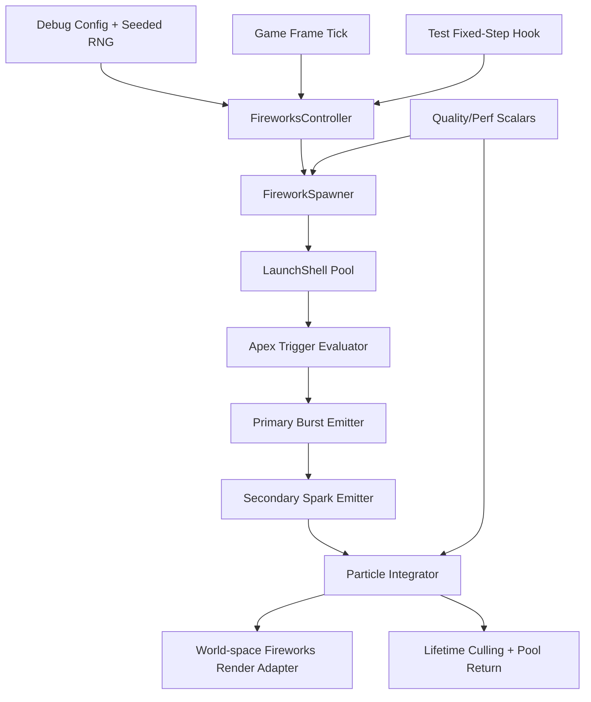
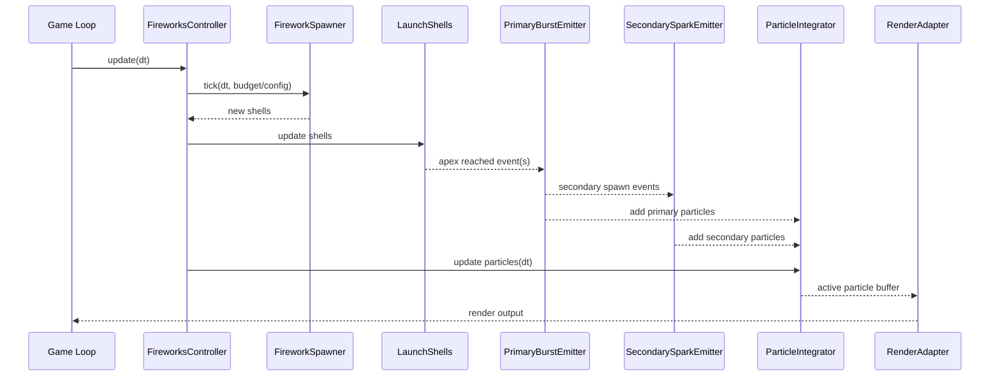
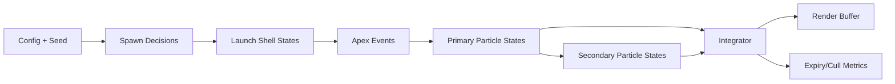

# Detailed Design: Fireworks Visual Overhaul

## Overview
This design replaces the current screen-space DOM fireworks pulse with a deterministic, budgeted, world-space fireworks subsystem tailored to the requested behavior:
- launch from varied positions behind the stack
- slight launch arc
- primary chrysanthemum-like spherical burst
- secondary sparks emitted from the primary burst
- secondary sparks drift downward and fade
- vivid multicolor styling
- increased firework activity while maintaining smooth performance on lower-end devices

The design aligns with repo architecture expectations (debug tunability + deterministic testability) and allows fully replacing the existing fireworks visual path.

---

## Detailed Requirements
(Consolidated from `idea-honing.md`)

1. **Visual + behavior enhancement**
   - Fireworks must feel more like chrysanthemum fireworks.
2. **Chrysanthemum priorities**
   - Spherical burst shape is critical.
   - Longer trails are critical.
3. **Placement behavior**
   - Fireworks should appear in varied positions behind the stack.
   - Placement should be fully random across the whole background region.
4. **Frequency/activity**
   - Firework launch frequency/count should increase compared with current behavior.
5. **Performance constraints**
   - Must remain smooth on lower-end devices/laptops.
6. **Color style**
   - Vivid multicolor palette.
7. **Per-firework sequence (applies to every firework)**
   - Launch upward from a location.
   - Follow slight arc.
   - Trigger primary burst.
   - Emit smaller secondary sparks from the primary burst.
   - Secondary sparks drift downward somewhat before fading.
8. **Debug/runtime tuning**
   - Add runtime debug controls for fireworks behavior parameters.
9. **Success criteria**
   - Effect is visibly chrysanthemum-like.
   - Placement is visibly more dynamic.
   - Performance remains stable.
10. **Implementation freedom**
   - Full replacement of the existing fireworks implementation is acceptable.

---

## Architecture Overview
The new system introduces a dedicated fireworks simulation module decoupled from distraction pulse rendering and connected to runtime debug controls.



### Key architecture decisions
- **Replace existing DOM actor** path for fireworks with in-world particle rendering.
- Keep fireworks under distraction channel gating (enable/start level), but decouple visual behavior from pulse-only signal.
- Use deterministic seeded RNG and fixed-step-compatible update path for test reproducibility.
- Enforce performance via hard particle caps, emission throttling, and pooling.

---

## Components and Interfaces

### 1) `FireworksController`
**Responsibility**
- Entry point called from game update loop.
- Reads relevant debug config + quality scalars.
- Advances spawner/simulation and submits render data.

**Interface (conceptual)**
- `update(deltaSeconds, context): void`
- `forceLaunch(count?: number): void` (debug action hook)
- `snapshot(): FireworksDebugSnapshot` (for deterministic tests/debug UI)

### 2) `FireworkSpawner`
**Responsibility**
- Determines when/where to launch shells.
- Samples world-space spawn positions behind stack across broad random range.
- Applies rate limits and burst throttles based on particle budget.

**Interface**
- `tick(deltaSeconds, env): LaunchShell[]`

### 3) `LaunchShell` simulation
**Responsibility**
- Simulate upward motion with slight arc.
- Trigger primary burst at apex condition.

**Apex trigger options**
- velocity threshold (`vy <= apexThreshold`) OR
- configured fuse elapsed

### 4) `PrimaryBurstEmitter`
**Responsibility**
- Emit near-spherical radial particle distribution.
- Apply vivid multicolor selection.
- Initialize long-trail particles.

### 5) `SecondarySparkEmitter`
**Responsibility**
- Spawn smaller sparks from subset/center of primary burst.
- Set lower initial velocity, more gravity effect, shorter size/lifetime profile.

### 6) `ParticleIntegrator`
**Responsibility**
- Per-frame physics/lifecycle update:
  - position/velocity integration
  - drag/friction
  - gravity
  - lifetime/alpha decay
  - size over life
- Despawn and pool return.

### 7) `FireworksRenderAdapter`
**Responsibility**
- Render particles in world space behind stack.
- Maintain depth coherence with camera projection.
- Handle trail visualization efficiently.

### 8) `FireworksPool`
**Responsibility**
- Reuse shell/particle objects to minimize allocations and GC spikes.

### Component interaction view



---

## Data Models

```ts
// conceptual model (not final code)
type FireworkStage = "launch" | "primary" | "secondary";

interface LaunchShellState {
  id: number;
  position: { x: number; y: number; z: number };
  velocity: { x: number; y: number; z: number };
  ageMs: number;
  fuseMs: number;
  active: boolean;
}

interface ParticleState {
  id: number;
  stage: FireworkStage;
  position: { x: number; y: number; z: number };
  velocity: { x: number; y: number; z: number };
  ageMs: number;
  lifetimeMs: number;
  sizeStart: number;
  sizeEnd: number;
  alphaStart: number;
  alphaEnd: number;
  hue: number;
  saturation: number;
  lightness: number;
  trailLength: number;
  active: boolean;
}

interface FireworksDebugConfig {
  fireworksLaunchRate: number;
  fireworksLaunchSpeedMin: number;
  fireworksLaunchSpeedMax: number;
  fireworksArcLateralBias: number;
  fireworksPrimaryParticleCount: number;
  fireworksPrimarySpeedMin: number;
  fireworksPrimarySpeedMax: number;
  fireworksSecondarySpawnChance: number;
  fireworksSecondaryCount: number;
  fireworksGravity: number;
  fireworksTrailDrag: number;
  fireworksLifetimeMs: number;
  fireworksMaxActiveParticles: number;
}

interface FireworksDebugSnapshot {
  activeShells: number;
  activeParticles: number;
  launchedShells: number;
  primaryBursts: number;
  secondaryBursts: number;
  culledForBudget: number;
}
```

### Data-flow diagram



---

## Error Handling

1. **Config sanitization**
   - Clamp debug values into safe ranges.
   - Correct invalid min/max pairs (swap/normalize).
2. **Budget overflow**
   - If at/near particle cap, degrade gracefully:
     - reduce per-burst particle count
     - skip secondary emissions first
     - throttle new launches
3. **Renderer fallback safety**
   - If render adapter initialization fails, disable fireworks rendering path for session and log warning, without breaking gameplay loop.
4. **Determinism guardrails**
   - Use seeded RNG source only (no `Math.random` in simulation path).
   - Fixed-step update mode for tests to avoid frame-delta instability.

---

## Testing Strategy

### Unit tests (non-rendering logic; target >=90% for touched non-rendering modules)
- Spawn rate + placement bounds behavior.
- Launch shell arc/apex triggering.
- Primary burst spherical distribution constraints.
- Secondary spark generation and downward drift behavior.
- Lifetime, alpha fade, size-over-life progression.
- Particle budget enforcement and degradation policy.
- Deterministic reproducibility (same seed + same steps => same snapshots/events).
- Debug config sanitization/clamping behavior.

### Playwright/E2E
- Fireworks visible at proper level gating when enabled.
- Debug controls affect live fireworks behavior.
- On-demand launch trigger produces expected staged lifecycle.
- Deterministic test mode can step and verify counts/events.
- Stability smoke test under increased launch activity.

### Manual validation checklist
- Clear launch arc visible.
- Primary spherical burst and long trails visible.
- Secondary sparks visibly drift down then fade.
- Placement appears varied behind stack.
- No major frame instability on low-end profile.

---

## Appendices

### A) Technology Choices

#### Choice 1: Replace DOM pulse with world-space particle subsystem (selected)
**Pros**
- Directly supports requested staged behavior.
- Better depth consistency behind stack.
- Easier to reason about physical lifecycle.

**Cons**
- Higher implementation complexity than CSS pulse.
- Requires careful performance budgeting.

#### Choice 2: Extend existing DOM pulse effect
**Pros**
- Lower initial effort.

**Cons**
- Poor fit for arc/secondary/drift behavior.
- Hard to achieve believable world-space depth.

### B) Research Findings Summary
- Typical fireworks implementations use launch + explosion stages with explicit particle lifecycle.
- Common controls include acceleration, friction/drag, gravity, particle count, and boundaries.
- Pooling and hard caps are standard for stable performance.
- Chrysanthemum visual reference emphasizes spherical breaks with visible trails.

### C) Existing Solution Analysis (current repo)
- Current fireworks path is a single DOM actor pulse (`Game.ts` + CSS).
- Positioning is viewport-relative and not physically simulated.
- No launch/apex/secondary lifecycle.

### D) Alternative Approaches Considered
1. **GPU-first shader-heavy system**
   - Better max throughput, but higher complexity and lower near-term maintainability.
2. **Hybrid CPU simulation + batched render**
   - Strong option if needed later for scaling.
3. **DOM-only enhancement**
   - Rejected due to poor fit with required staged behavior.

### E) Constraints and Limitations
- Must preserve smooth behavior on lower-end devices.
- Must remain deterministic for tests.
- Must integrate with existing distraction gating and debug surface.
