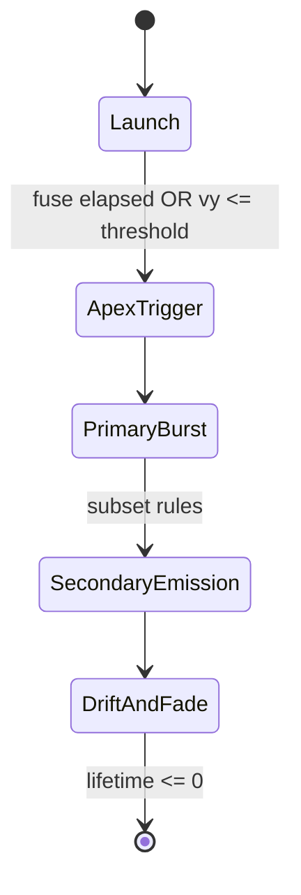

# Research: Existing Fireworks Effect Implementations

## Goal
Summarize common implementation patterns used in real-time fireworks effects and extract a fit-for-purpose approach for this project.

## Pattern A: CPU Particle System with Staged Emitters (Most Common in Web Games)

### How it works
1. Spawn a launch shell particle/entity with velocity and gravity.
2. Integrate shell motion each frame (Euler/Verlet).
3. On fuse timeout or vertical-velocity threshold, emit primary burst particles radially.
4. Some primary particles spawn secondary particles after a delay or at lifetime fraction.
5. All particles apply gravity, drag, color/alpha/size-over-life.
6. Despawn via lifetime expiration and pool reuse.

### Why teams use it
- Straightforward to tune and debug.
- Deterministic with seeded RNG.
- Easy to add staged behavior (exactly what is requested here).

### Tradeoffs
- CPU cost rises with particle count.
- Needs pooling and hard budgets for low-end stability.

## Pattern B: GPU Instanced/Billboard Particle Rendering

### How it works
- Particle simulation or attributes are sent to GPU (instancing/point sprites).
- Vertex/fragment shaders handle billboard orientation and visual falloff.

### Why teams use it
- Large particle counts with better throughput.

### Tradeoffs
- Higher implementation complexity.
- Harder to debug stage transitions.
- Overkill for moderate decorative background fireworks.

## Pattern C: Hybrid (CPU Simulation + Batched Rendering)

### How it works
- CPU handles lifecycle/state transitions.
- Renderer uses one/few draw calls (points/instanced quads) for active particles.

### Why teams use it
- Maintains design flexibility with better runtime than many DOM nodes.

### Tradeoffs
- More implementation surface than pure CPU + simple meshes.

## Typical Multi-Stage Firework Lifecycle

## Common Behaviors for Chrysanthemum-Style Shells
- Near-spherical primary burst with evenly distributed radial directions.
- Bright initial expansion, then trailing particles.
- Secondary stars with weaker initial velocity.
- Gravity-driven downward drift and fade near tail end.

## Performance Strategies Seen Across Implementations
- Fixed `maxActiveParticles` hard cap.
- Emission budget per frame and per burst.
- Distance/visibility gating (don’t simulate off-screen-heavy effects at full fidelity).
- Temporal staggering: avoid simultaneous huge bursts.
- Object pooling to avoid GC spikes.

## External References
- Three.js Points docs: https://threejs.org/docs/#api/en/objects/Points
- Three.js PointsMaterial docs: https://threejs.org/docs/#api/en/materials/PointsMaterial
- Babylon.js particle systems overview: https://doc.babylonjs.com/features/featuresDeepDive/particles/particle_system
- pixi-particle-emitter project: https://github.com/pixijs/particle-emitter
- Chrysanthemum shell (fireworks taxonomy): https://en.wikipedia.org/wiki/Firework#Types

> Note: This project currently uses a custom game loop and Three.js scene primitives; references above are used to compare implementation patterns and performance practices.
