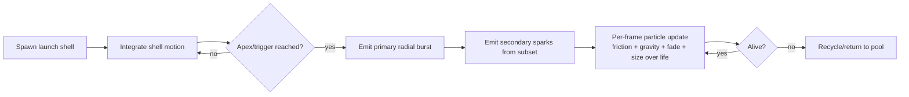

# Research: Web Findings on Typical Fireworks Implementations

## Objective
Investigate how fireworks are typically implemented in games/web graphics, based on public docs/tutorials/libraries.

## Synthesis (What people typically do)

### 1) Two-stage model is common
Most implementations separate:
1. **Launch/trace (rocket)**: a moving shell with speed/acceleration toward an apex/target.
2. **Explosion particles**: many particles with randomized direction, drag/friction, gravity, alpha decay, and finite lifetime.

This maps directly to your requested behavior (launch arc → burst → smaller drifting sparks).

### 2) Per-particle state is usually simple and explicit
Common state per particle (or per trace/explosion particle):
- `position`
- `velocity` (or angle+speed)
- `acceleration` (global gravity + optional per-particle)
- `lifetime`/`age` or `alpha` decay
- visual params (size, color, brightness, trail length)

### 3) Update loop is fixed, lightweight math
Typical per-frame update:
- integrate velocity/position
- apply drag/friction and gravity
- update opacity/size/color over life
- recycle/deactivate when expired

### 4) Emitters and custom spawn logic are standard
Framework docs (Babylon, Pixi, Unity) consistently expose emitter patterns:
- custom start position/direction
- configurable spawn shapes/ranges
- configurable burst rates and particle counts
- pooling/reuse to avoid allocation pressure

### 5) Performance guardrails are widely recommended
- pooling/reuse instead of frequent alloc/free
- bounded particle counts and burst sizes
- reset particle state on reuse
- constrain spawn bounds and update rates

## Evidence from Specific Web Sources

### A) firework-js (open-source fireworks library)
`https://github.com/crashmax-dev/fireworks-js`

Observed defaults and architecture:
- Options include `acceleration`, `friction`, `gravity`, `particles`, `explosion`, `traceLength`, `traceSpeed`, `boundaries`, `lineWidth`.
- Separate classes for **Trace** (rocket) and **Explosion** (burst particles).
- `Trace.update`: speed accelerated over time until target distance reached.
- `Explosion.update`: applies friction + gravity and fades alpha via decay; particles removed when transparent.

Interpretation: canonical launch-then-burst model with lightweight physics and configurable knobs.

### B) Babylon.js particle customization docs
`https://doc.babylonjs.com/features/featuresDeepDive/particles/particle_system/customizingParticles`

Key points:
- Customizable `startDirectionFunction`, `startPositionFunction`, and `updateFunction`.
- Default update loop explicitly demonstrates age/lifetime recycle, color/size/angle updates, position integration, and gravity application.
- Supports custom emitter types and custom effects/shaders.

Interpretation: mainstream engine recommends explicit emitter + update-function control for tailored effects (including fireworks-like patterns).

### C) LearnOpenGL particle tutorial
`https://learnopengl.com/In-Practice/2D-Game/Particles`

Key points:
- Defines particle emitters that spawn particles and recycle on life expiry.
- Typical particle attributes include position, velocity, color, life.
- Large groups of simple particles create convincing visual phenomena.

Interpretation: same core lifecycle model appears in low-level graphics tutorials.

### D) Unity docs (particle + pooling)
- Particle effects overview: `https://docs.unity3d.com/Manual/ParticleSystems.html`
- Pooling/reuse guidance: `https://docs.unity3d.com/Manual/performance-reusable-code.html`

Key points:
- Particle systems are designed to simulate many small elements collectively.
- Pooling/reuse is recommended to reduce allocation churn and GC overhead.

Interpretation: for smooth low-end performance, pooling and bounded counts are baseline best practice.

### E) Firework taxonomy reference (visual behavior)
`https://en.wikipedia.org/wiki/Firework#Types`

Relevant description:
- **Chrysanthemum**: spherical break of colored stars that leave visible spark trails.

Interpretation: requested visual target is well aligned with a spherical primary burst + trailing stars.

## Typical Implementation Blueprint (derived)

## Fit to this project
- Matches your desired sequence exactly.
- Supports vivid multicolor and long trails naturally.
- Can be kept performant via hard caps + pooling + deterministic stepping.

## Practical guidance for next design step
- Prefer replacing current DOM pulse effect with a staged world-space particle subsystem.
- Keep configurable debug controls for launch arc, burst density, secondary count, gravity, fade, and max active particles.
- Include deterministic seeded RNG and fixed-step simulation hooks for tests.
