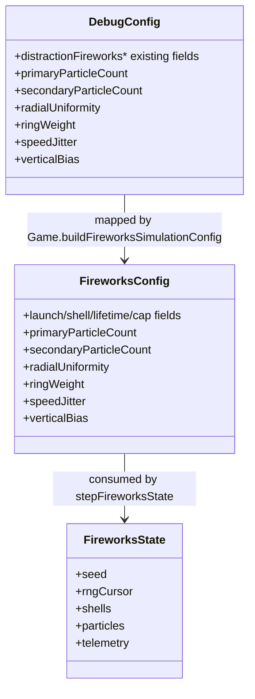
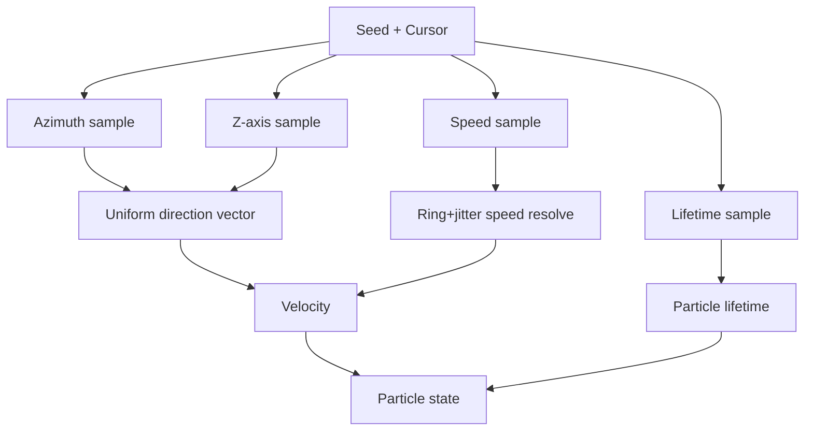

# Fireworks Chrysanthemum Starburst — Detailed Design

## Overview
This design updates Tower Stacker’s fireworks burst generation so explosions render as a circular chrysanthemum-style starburst instead of the current bell-like shape. The change applies to all fireworks by default and replaces prior burst behavior without fallback mode.

The implementation keeps deterministic seeded behavior in test mode, introduces runtime debug tuning controls for burst morphology, preserves existing cap/performance guardrails, and adds screenshot-based deterministic visual verification aligned to the provided reference image:

`/Users/jamiely/Library/Containers/cc.ffitch.shottr/Data/tmp/cc.ffitch.shottr/SCR-20260401-sfur.jpeg`

---

## Detailed Requirements

### Functional requirements
1. Fireworks bursts must appear circular/chrysanthemum-like rather than bell-shaped.
2. The new burst applies to all fireworks by default.
3. The previous burst behavior is removed (no fallback toggle).
4. A single universal chrysanthemum preset is used in gameplay (no style variants).
5. Runtime debug controls must be available for tuning burst morphology.
6. Deterministic seed behavior must be preserved in test mode.
7. Screenshot verification in deterministic Playwright flow is required for appearance validation.
8. Tests must be adjusted/extended to cover new behavior.

### Non-functional requirements
1. Maintain current performance characteristics, including low-end device expectations.
2. Continue honoring active-particle cap constraints and degradation strategy.
3. Keep integration aligned with existing test API and debug-panel architecture.

### Scope interpretation decisions
- Particle geometry and particle-property tuning are both allowed if needed to achieve accurate chrysanthemum appearance.
- Priority is visual accuracy of the chrysanthemum pattern while respecting existing safety constraints.

---

## Architecture Overview

The architecture remains simulation-first:
- burst generation logic is updated in the deterministic simulation core
- debug controls flow through existing config clamp and UI surfaces
- rendering adapter remains mostly unchanged
- deterministic E2E captures visual output at reproducible ticks

```mermaid
flowchart LR
  A[Debug Panel Controls\nGame.ts] --> B[DebugConfig + clampDebugConfig]
  B --> C[buildFireworksSimulationConfig]
  C --> D[stepFireworksState\nlogic/fireworks.ts]
  D --> E[FireworksState\n(shells/particles/telemetry)]
  E --> F[updateFireworksLayer\nDOM mapping]
  F --> G[Visual starburst output]

  H[Test API + seed + paused stepping] --> D
  H --> E
```

---

## Components and Interfaces

### 1) Fireworks simulation core (`src/game/logic/fireworks.ts`)
**Changes**
- Replace current burst-direction sampling with isotropic radial sampling suited to circular starbursts.
- Add optional ring-influenced radial speed distribution controls (single preset tuning, not style switching).
- Keep deterministic RNG cursor accounting exact and explicit.

**Interface evolution**
- Extend `FireworksConfig` with burst-shape fields (proposed):
  - `primaryParticleCount`
  - `secondaryParticleCount`
  - `radialUniformity`
  - `ringWeight`
  - `speedJitter`
  - `verticalBias`
- Maintain backward-compatible deterministic stepping semantics and telemetry contracts.

### 2) Debug configuration + clamps (`src/game/types.ts`, `src/game/debugConfig.ts`)
**Changes**
- Add matching fields to `DebugConfig` and defaults in `defaultDebugConfig`.
- Clamp/normalize new values in `clampDebugConfig` (including min/max and integer constraints where needed).

### 3) Game wiring + debug panel (`src/game/Game.ts`)
**Changes**
- Add slider metadata in `DEBUG_RANGES` for new controls.
- Include new values in `buildFireworksSimulationConfig()`.
- Preserve existing update semantics: debug config applies on next simulation step in test-mode paused flows.

### 4) Visual layer (`src/styles.css`, `Game.ts` render adapter)
**Changes**
- Keep DOM entity mapping stable.
- Optional minor style tweaks to particle size/alpha/primary-vs-secondary emphasis if needed to better match chrysanthemum reference.

### 5) Test suites
- Unit tests: expand simulation assertions for distribution behavior and config sanitization.
- E2E tests: add deterministic screenshot-based fireworks visual test + maintain existing lifecycle/cap assertions.



---

## Data Models

### FireworksConfig additions (proposed)
- `primaryParticleCount: number` (int)
- `secondaryParticleCount: number` (int)
- `radialUniformity: number` (0..1)
- `ringWeight: number` (0..1)
- `speedJitter: number` (0..1)
- `verticalBias: number` (small bounded range, e.g., -0.35..0.35)

### Sampling model
- Direction generated with isotropic spherical sampling to remove bell bias.
- Radial speed generated from base min/max plus optional ring-weighted quantization and jitter.
- Secondary bursts retain differentiation but follow same morphology principles.

### Telemetry
- Reuse existing lifecycle telemetry; no breaking changes required.
- Optional: lightweight debug-only metrics for radial spread (if needed for additional numeric regression checks).



---

## Error Handling

1. **Config bounds and invalid values**
   - All new config fields clamped in `clampDebugConfig` and sanitized in simulation config pipeline.
   - Non-finite values fall back to defaults, consistent with current behavior.

2. **Particle budget pressure**
   - Preserve `maxActiveParticles` cap.
   - Preserve secondary-drop-first behavior before primary degradation.

3. **Determinism integrity**
   - Ensure RNG cursor increments are deterministic and identical for equal seeds/config/input sequences.
   - Avoid non-seeded randomness in burst-shape path.

4. **Screenshot stability concerns**
   - Use paused deterministic stepping and fixed seed/config.
   - Capture at a fixed simulation tick window.

---

## Testing Strategy

### Unit tests (non-rendering)
1. Update/extend `tests/unit/fireworks.test.ts` to validate:
   - deterministic replay unchanged with same seed/config
   - new config clamping/normalization for shape fields
   - distribution sanity (e.g., reduced vertical bias over sample sets; configurable bias effects)
   - cap/cleanup guarantees remain valid under new particle counts

2. Update `tests/unit/debugConfig.test.ts`:
   - clamp ranges for new debug fields
   - min/max normalization rules where applicable

### Playwright E2E tests
1. Add deterministic screenshot verification test in `tests/e2e/fireworks.spec.ts`:
   - load `?debug&test&paused=1&seed=<fixed>`
   - apply fixed fireworks config
   - step to deterministic burst moment
   - capture screenshot and compare baseline
   - baseline visually aligned to provided reference style

2. Keep existing fireworks lifecycle/counter/cleanup/cap tests passing.

### Manual validation
- In debug panel, tune new knobs and confirm visual movement toward/away from chrysanthemum shape in real time.

---

## Appendices

### A) Technology choices

#### Choice: isotropic sphere sampling for burst direction
- **Pros**: circular radial spread, low compute overhead, deterministic-friendly.
- **Cons**: may still require speed/lifetime tuning to match artistic reference exactly.
- **Decision**: adopt.

#### Choice: single universal preset + debug tunables
- **Pros**: matches requirement; no mode complexity.
- **Cons**: fewer explicit style switches for experimentation.
- **Decision**: adopt.

#### Choice: screenshot-based deterministic visual verification
- **Pros**: directly validates user-visible goal.
- **Cons**: snapshot maintenance sensitivity.
- **Decision**: adopt with fixed seed and step timing.

### B) Existing solutions analysis (repo-local)
- Existing simulation already deterministic and testable.
- Existing debug plumbing already supports rapid control extension.
- Existing e2e tests already validate lifecycle robustness but need visual morphology assertions.

### C) Alternative approaches considered
1. Keep current sampling and only tweak gravity/drag:
   - rejected; likely insufficient to remove bell-shaped perception.
2. Multiple selectable burst styles:
   - rejected; requirement is one universal default style.
3. Full physics particle simulation:
   - rejected; unnecessary complexity/performance risk.

### D) Constraints and limitations
- Must preserve low-end performance behavior.
- Must preserve deterministic test-mode semantics.
- Must remove old behavior path (no fallback).
- Visual target judged against provided external reference image.
