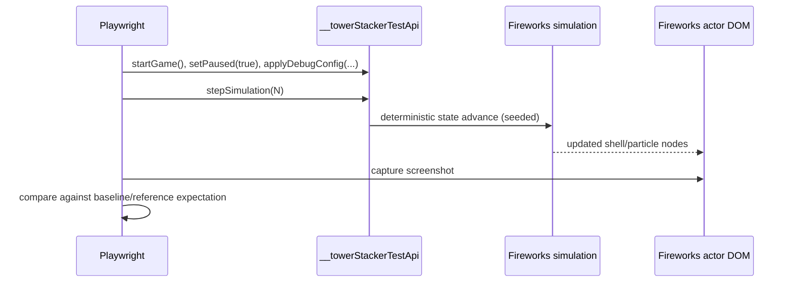

# Deterministic Visual Verification Research

## Goal
Define a stable screenshot-based verification flow for the new chrysanthemum burst appearance.

## Current state
- Deterministic stepping exists through `__towerStackerTestApi` with `?test&paused=1&seed=...`.
- Fireworks e2e tests already exercise lifecycle counters and deterministic state stepping.
- No existing screenshot assertion for fireworks morphology.

## Proposed verification strategy

### 1) Freeze and script the setup
- Launch with deterministic flags: `/?debug&test&paused=1&seed=<fixed>`.
- Apply fixed fireworks config through test API (fixed launch interval/speed/gravity/delay/lifetime).
- Trigger a known launch path (debug button or forced channel).
- Step exact number of ticks to a known visual phase (e.g., immediately post-primary burst).

### 2) Capture canonical screenshot region
- Screenshot full page or actor region (`[data-testid="actor-fireworks"]`).
- Keep camera/game progression controlled so framing is repeatable.

### 3) Compare to committed baseline and/or reference-guided acceptance
- Primary automated check: Playwright snapshot comparison (`toHaveScreenshot` flow).
- Human acceptance reference provided by user:
  - `/Users/jamiely/Library/Containers/cc.ffitch.shottr/Data/tmp/cc.ffitch.shottr/SCR-20260401-sfur.jpeg`

### 4) Add backup numeric shape sanity checks (optional but robust)
- Compute centroid and radial variance of active primary particles in test API state.
- Assert near-isotropic spread thresholds to catch regressions before visual diffs.

## Test flow diagram

## Notes on tool usage
- No additional external search tools were used in this research pass.
- Research here is codebase-driven and user-reference-driven.

## References
- `tests/e2e/fireworks.spec.ts`
- `tests/e2e/clouds.spec.ts` (example of screenshot attachments)
- `src/game/logic/fireworks.ts`
- `src/game/Game.ts`
- User-provided visual reference image path above
