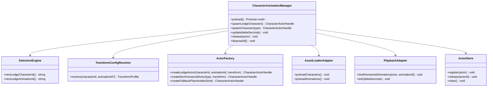
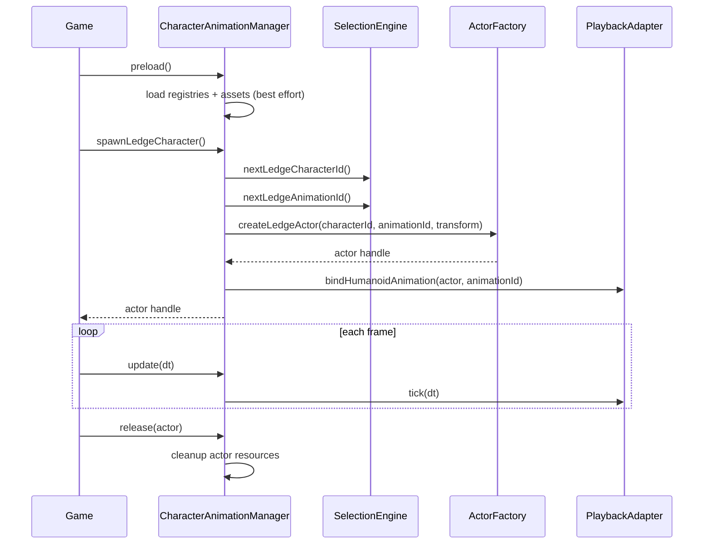

# Detailed Design: Character Animation System Refactor

## Overview

This design refactors Tower Stacker’s current character animation implementation from a `Game.ts`-embedded, Remy-centric workflow into a centralized, testable, character-agnostic manager.

The new design introduces a **single facade class** (working name: `CharacterAnimationManager`) that hides asset loading, selection strategy, animation playback, placement/scaling resolution, and runtime actor lifecycle from the main game class.

The refactor scope is intentionally limited to **character animation only**:

- ✅ Humanoid ledge characters (Mixamo-compatible, mix-and-match clips)
- ✅ Non-humanoid explicit movers (`bat`, `ufo`, `gorilla`)
- ❌ Particle/effects systems like fireworks (deferred)

Design goals:

1. Remove Remy-specific runtime naming and assumptions.
2. Support per-character and per-(character, animation) transform tuning.
3. Keep normal gameplay API minimal and non-leaky.
4. Preserve existing visible behavior as closely as possible.
5. Significantly improve unit-testability and regression resistance.

---

## Detailed Requirements

Consolidated from `idea-honing.md`.

### Scope and behavior

- The refactor manages **characters only**; fireworks/particle effects remain outside this class for now.
- Humanoid characters must support **full mix-and-match** animation by default.
- Non-humanoid characters (`bat`, `ufo`, `gorilla`) must be available through the same public manager, while internal implementation paths may differ.

### Main-game contract

- Main game must not select individual ledge humanoids directly.
- Main game must call:
  - `spawnLedgeCharacter()` (manager internally selects “next” ledge character + animation)
  - `spawnCharacter('bat' | 'ufo' | 'gorilla')` (explicit non-ledge mover request)
- Main game should not pass model/clip internals.
- Spawn methods should be minimal (no position args required); game places/paths returned actors.

### Selection and determinism

- Manager accepts optional seed at initialization.
- Manager remains unaware of ledge concepts in world topology; it only serves request types.
- Ledge character selection is **round-robin**.
- Ledge animation selection is **round-robin**.
- Manager must expose explicit `update(dt)` for deterministic stepping.

### Lifecycle and loading

- Manager owns preload/loading (`preload()`).
- Preload failure strategy is **best-effort**; skip failed assets and continue.
- Non-fatal preload issues can be console-logged (no status API required now).
- Manager owns actor lifecycle cleanup (`release(actor)`, `disposeAll()`).
- If no ledge humanoid assets are available, `spawnLedgeCharacter()` returns a **fallback placeholder actor**.

### Transform tuning and debug controls

- Transform resolution hierarchy:
  1. global defaults
  2. per-character overrides
  3. per-(character, animation) overrides
- Runtime debug controls required now (full tuning mode deferred).
- Required controls: per-profile position + rotation + scale.
- Debug UX flow:
  - character dropdown
  - optional animation dropdown
  - sliders + reset
- Session-only tuning persistence for now.

### Naming and maintainability

- Remove Remy-specific naming and assumptions from runtime APIs/configs.
- Preserve current visual behavior as closely as possible.
- Resulting architecture should maximize unit-testability.

### Testing and regressions

- Selection/config logic should be pure where possible.
- Deterministic seed behavior should be unit-tested.
- Add explicit regression tests for:
  - round-robin sequencing
  - spawn API behavior (`spawnLedgeCharacter`, `spawnCharacter('bat'|'ufo'|'gorilla')`)

---

## Architecture Overview

### High-level approach

Use a facade + strategy/adapters architecture:

- `Game` consumes a minimal manager API.
- `CharacterAnimationManager` orchestrates internal components.
- Pure modules handle selection and transform resolution.
- Runtime adapters handle asset loading/playback and actor realization.

```mermaid
flowchart LR
  G[Game] --> M[CharacterAnimationManager Facade]

  M --> SEL[SelectionEngine\n(round-robin + seed)]
  M --> CFG[TransformConfigResolver\n(global + char + char+anim)]
  M --> REG[CharacterRegistry + AnimationRegistry]
  M --> LD[AssetLoaderAdapter]
  M --> PF[PlaybackAdapter\n(mixer/retarget or overlay)]
  M --> ST[ActorStore + Lifecycle]
  M --> DBG[DebugTuningAdapter]

  LD --> AS[(Assets)]
  PF --> RT[(Runtime actors)]
  ST --> RT
```

### Component relationships



### Request/data flow



---

## Components and Interfaces

## 1) `CharacterAnimationManager` (public facade)

Proposed public API (game-facing):

```ts
type NonLedgeCharacterType = 'bat' | 'ufo' | 'gorilla';

interface CharacterAnimationManager {
  preload(): Promise<void>;
  spawnLedgeCharacter(): CharacterActorHandle;
  spawnCharacter(type: NonLedgeCharacterType): CharacterActorHandle;
  update(deltaSeconds: number): void;
  release(actor: CharacterActorHandle): void;
  disposeAll(): void;
}
```

### Responsibilities
- Hold no world-pathing knowledge.
- Own selection progression and deterministic state.
- Delegate realization to per-kind actor backends.
- Provide placeholder fallback actor when ledge humanoid pool unavailable.

## 2) Registry and profile layer

### `CharacterRegistry`
- Defines all supported characters and kind (`humanoid`, `bat`, `ufo`, `gorilla`).
- Maps character IDs to asset sources/backends.

### `AnimationRegistry`
- Defines humanoid animation profiles.
- Supports round-robin enumeration for ledge animations.

### `TransformProfileRegistry`
- Stores:
  - global transform defaults
  - per-character overrides
  - per-(character, animation) overrides

## 3) Pure policy modules

### `SelectionEngine`
- deterministic round-robin character cycle for ledge humanoids
- deterministic round-robin animation cycle for ledge animations
- optional seeded initialization for deterministic ordering

### `TransformConfigResolver`
- applies precedence rules and produces final runtime transform profile

## 4) Runtime adapters

### `HumanoidActorBackend`
- loads/realizes humanoid actor assets
- binds selected animation
- handles playback updates and teardown

### `OverlayActorBackend` (or equivalent existing non-humanoid adapter)
- realizes `bat`/`ufo`/`gorilla` in their current behavior path
- keeps unified handle contract with humanoid actors

### `PlaybackAdapter`
- centralized `tick(deltaSeconds)` for mixers and backend playback updates

## 5) Debug integration boundary

`DebugCharacterTuningAdapter` (debug-only boundary)
- lists selectable character profiles
- optional animation selector data
- applies session-only override updates
- resets per-scope overrides

Normal gameplay path does not require debug IDs.

---

## Data Models

```ts
type CharacterKind = 'ledge' | 'bat' | 'ufo' | 'gorilla';
type HumanoidCharacterId = string;
type HumanoidAnimationId = string;

type Vector3Like = { x: number; y: number; z: number };

type TransformProfile = {
  position: Vector3Like;
  rotation: Vector3Like; // Euler degrees or radians (single convention required)
  scale: Vector3Like;
};

type CharacterProfile = {
  id: string;
  type: CharacterKind;
  backend: 'humanoid' | 'overlay';
  assetRefs?: { modelUrl?: string; animationUrls?: string[] };
};

type CharacterActorHandle = {
  id: string;
  kind: CharacterKind;
  object: unknown; // wrapped runtime actor object
  dispose?: () => void;
};
```

### Selection state

```ts
type SelectionState = {
  ledgeCharacterIndex: number;
  ledgeAnimationIndex: number;
};
```

### Transform override model

```ts
type TransformOverrides = {
  global: Partial<TransformProfile>;
  byCharacter: Record<string, Partial<TransformProfile>>;
  byCharacterAnimation: Record<string, Partial<TransformProfile>>; // key: `${characterId}:${animationId}`
};
```

---

## Error Handling

### Preload
- Best-effort preload across character/animation assets.
- Failures are logged with enough context (asset ID/path).
- Manager marks failed entries unavailable for spawn selection.

### Spawn
- `spawnLedgeCharacter()`:
  - If at least one humanoid character+animation path is available, spawn using round-robin selection.
  - If none available, create fallback placeholder actor.
- `spawnCharacter('bat'|'ufo'|'gorilla')`:
  - If requested backend unavailable, return fallback placeholder actor of requested kind.

### Update/Lifecycle
- `update(dt)` clamps invalid/negative dt to safe behavior.
- `release(actor)` is idempotent (safe repeated calls).
- `disposeAll()` disposes all actors and playback resources safely.

### Compatibility
- Humanoid clip/model compatibility failures trigger fallback clip path before giving up.
- Existing retarget fallback remains available internally but hidden from `Game`.

---

## Testing Strategy

This strategy aligns with repo standards: deterministic test mode, runtime debug controls, Playwright core-flow coverage, and >=90% non-rendering unit coverage.

### Unit tests (primary regression shield)

1. **SelectionEngine**
   - round-robin character order
   - round-robin animation order
   - deterministic seed initialization behavior

2. **TransformConfigResolver**
   - global only
   - character override precedence
   - character+animation override precedence

3. **Spawn policy**
   - ledge spawn internal selection (no direct ledge character ID input)
   - explicit `bat`/`ufo`/`gorilla` spawn behavior
   - fallback placeholder behavior on unavailable assets

4. **Lifecycle behavior**
   - register/release/disposeAll
   - idempotent release
   - update tick forwarding

5. **Best-effort preload**
   - partial success handling
   - failed assets excluded from active selection pools

### Integration tests (manager with fakes)
- manager + fake loader + fake playback backends
- deterministic spawn/update/release flow
- verify manager facade hides backend internals

### Playwright / end-to-end
- existing game flow remains stable after manager integration
- ledge actors continue appearing and animating
- explicit `bat`, `ufo`, and `gorilla` request paths remain operable in game behavior
- debug panel character selector + transform sliders affect active actor placement in-session

### Coverage target
- Place newly extracted non-rendering logic into `src/game/logic/**` (or similarly included paths) so current coverage thresholds enforce the new architecture.
- Keep heavy rendering/three.js binding code in thin adapter layers, with most decision logic covered by unit tests.

---

## Appendices

## Appendix A: Technology Choices

### 1) Facade manager + internal adapters (chosen)
**Pros**
- Meets “hide implementation details” goal directly.
- Keeps `Game` API minimal and stable.
- Supports mixed implementations (humanoid 3D + non-humanoid overlay).
- Improves unit-testability by isolating pure policy modules.

**Cons**
- Requires extraction work from `Game.ts` and temporary integration complexity.

### 2) Keep logic in `Game.ts` with renaming only (rejected)
**Pros**
- low initial change volume.

**Cons**
- does not solve coupling/regression risk root cause.
- poor alignment with testability requirement.

### 3) Full ECS rewrite (deferred/rejected)
**Pros**
- long-term scalability.

**Cons**
- too large for this refactor; high behavior-drift risk.

## Appendix B: Existing Solution Analysis (repo-specific)

- Current code already has useful pure helpers in `logic/remy.ts` and deterministic infra in `logic/random.ts` + test mode.
- Current runtime currently mixes ledge character logic with slab decoration and distraction logic in `Game.ts`.
- Bat/UFO/Gorilla currently use overlay actors in distraction flow; this should be respected to preserve behavior in this phase while exposing explicit spawn support through the manager facade.

## Appendix C: Alternative Approaches Considered

1. **Unified 3D actor conversion for bat/ufo/gorilla now**
   - Deferred to avoid behavior drift and asset migration complexity.

2. **Expose character IDs to main game for all spawns**
   - Rejected for ledge path because requirement is internal selection only.

3. **Persist debug tuning in localStorage now**
   - Deferred; session-only selected for this phase.

## Appendix D: Key Constraints and Limitations

- Preserve visible behavior as closely as possible while refactoring architecture.
- Keep fireworks/effects out of manager scope for now.
- No dedicated full “character tuning mode” in this phase; only runtime controls.
- Best-effort preload means runtime may continue with partial character set; fallback placeholders must prevent hard failure.
- Existing coverage config excludes large rendering class (`Game.ts`), so extracted logic placement matters for enforced test coverage.
