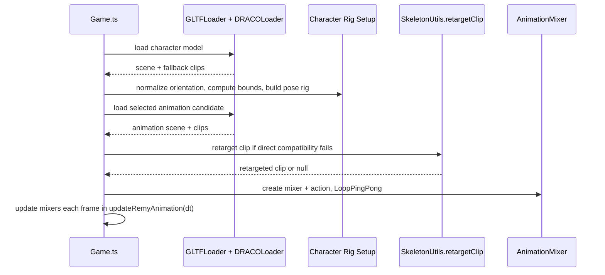

# Research: Asset Loading, Character Types, and Animation Compatibility

## Asset Inventory (current)

From `assets/`:

- Humanoid character models:
  - `remy_character_t_pose.glb`
  - `timmy_tiny_webp.glb`
  - `amy_tiny_webp.glb`
  - `aj_tiny_webp.glb`
- Dance animation clips:
  - `remy_hip_hop_animation_inplace.glb`
  - `house_dancing_inplace.glb`
  - `chicken_dance_inplace.glb`
  - `ymca_dance_inplace.glb`
- No separate bat/ufo/gorilla GLTF assets are currently present; these visuals are currently rendered as CSS/DOM actor overlays in distraction flow.

## Current Humanoid Animation Pipeline

## Compatibility Strategy in Current Code

- First tries direct clip compatibility against target model track names.
- Falls back to retargeting via `retargetClip(...)` if needed.
- Strips scale tracks from clip before playback to reduce limb-stretch artifacts.
- Uses fallback clip selection if animation load/retarget fails.

## Current Type-Split Reality

1. **Humanoid (Mixamo-style)**
   - Asset-based 3D rig + clip playback
   - Supports mix-and-match with fallback behavior

2. **Non-humanoid bat/ufo/gorilla**
   - Rendered as 2D overlay actors tied to distraction simulation
   - Not loaded from character asset registry
   - Not represented as spawned 3D actor instances via same manager contract

## Refactor Impact

To satisfy a unified public API while preserving current behavior:

- Internal implementation should support **multiple backends** behind one facade:
  - `HumanoidCharacterBackend` (GLTF rig/clip/mixer)
  - `OverlayActorBackend` (bat/ufo/gorilla current behavior)
- `spawnCharacter('bat'|'ufo'|'gorilla')` can return handles wrapping overlay actors without forcing immediate 3D asset migration.
- `spawnLedgeCharacter()` can keep humanoid selection and clip selection internal and deterministic/round-robin.

## Recommended Registry Model (for refactor)

- `CharacterProfileRegistry`
  - profile kind: `humanoid | nonHumanoid`
  - transform defaults and per-animation overrides
  - availability / fallback rules
- `AnimationProfileRegistry` (for humanoids)
  - clip id
  - load path
  - compatibility metadata (optional)
- `CharacterSpawnPolicy`
  - round-robin state for ledge characters
  - round-robin state for ledge animation choices

## Source References
- `assets/*`
- `src/game/Game.ts` (loading, retargeting, mixer setup)
- `src/styles.css` (bat/ufo/gorilla actor visuals)
- `src/game/logic/remy.ts` (selection helper utilities)
