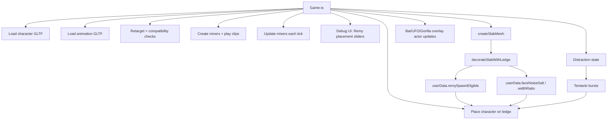

# Research: Current Animation Architecture Audit

## Scope
Audit the current repo implementation for character animation responsibilities, coupling points, and integration boundaries relevant to the refactor.

## Key Findings

1. **Character animation is deeply coupled into `Game`**
   - `src/game/Game.ts` directly owns:
     - asset loading (`GLTFLoader`, `DRACOLoader`)
     - clip compatibility checks and retargeting (`retargetClip`)
     - mixer playback (`AnimationMixer`)
     - placement on ledges and fallback placement
     - lifecycle coordination with slab spawning and distraction events
   - This makes `Game` both orchestration layer and implementation layer.

2. **Runtime naming and APIs are Remy-centric**
   - Runtime logic, constants, and debug controls are heavily `Remy`-named (`REMY_*`, `RemyDebugConfig`, `placeRemyOnTopLedge`, `loadRemyCharacter`, etc.).
   - This creates conceptual mismatch now that multiple characters/animations are supported.

3. **Ledge character behavior is bound to slab decoration flow**
   - Ledge creation happens inside `createSlabMesh(...)` via `decorateSlabWithLedge(...)`.
   - Ledge metadata (`isLedge`, `faceNoiseSalt`, `widthRatio`, `remySpawnEligible`) is stored as mesh `userData` and consumed by character-placement logic.
   - Character placement decisions therefore depend on building-decoration internals.

4. **Bat/UFO/Gorilla use a different path than humanoid dancers**
   - Bat/UFO/Gorilla are currently distraction overlay actors (`.distraction-actor--bat`, `.distraction-actor--ufo`, `.distraction-actor--gorilla`) driven by distraction state.
   - They are not part of the humanoid GLTF + clip pipeline.

5. **Selection behavior currently implemented**
   - Character selection: strict rotation index (`drawNextRemyCharacterIndex`) through character assets.
   - Animation selection: non-repeating random selection (`pickNonRepeatingIndex`) with fallback candidate ordering.
   - Wide ledges can spawn dual characters.

## Current Responsibility Graph

## Coupling Hotspots (high regression risk)

- `Game.resetWorld()` starts/loading and clears all character state in one place.
- `spawnNextActive()` and `stopActiveSlab()` indirectly affect character placement through ledge creation and refresh logic.
- `placeRemyOnTopLedge()` combines:
  - anchor validity
  - visibility
  - tentacle suppression
  - lane/dual-spawn
  - transform tuning
- Debug UI writes directly into runtime placement state.

## Implications for Refactor

- A central character-animation manager is feasible but requires extracting logic currently spread across:
  - slab decoration metadata usage,
  - character selection/loading,
  - animation playback,
  - debug transform application,
  - actor lifecycle cleanup.
- A stable facade will need to hide these concerns from `Game` while still accepting minimal spawn intent (`ledge` internal selection, explicit `bat|ufo|gorilla` external selection).

## Source References
- `src/game/Game.ts`
- `src/game/logic/remy.ts`
- `src/game/logic/distractions.ts`
- `src/styles.css`
