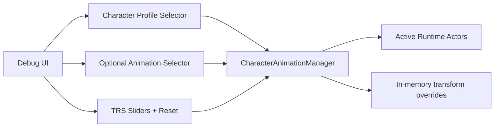

# Research: Debug Controls and Runtime Tuning Surface

## Current Debug Surface (relevant subset)

Current runtime debug panel in `Game.ts` includes dedicated dancer controls under **"Remy Placement"**:

- Rotation sliders: X/Y/Z
- Translation sliders: X/Y/Z
- Per-character default offsets are hardcoded (Remy/Timmy/Amy/AJ)
- Reset action: `Reset Remy Placement`

These controls directly mutate runtime placement state in `Game` and immediately re-place the active dancer anchor.

## Gaps vs Refactor Requirements

1. **Naming gap**
   - Controls are Remy-specific, not character-profile oriented.

2. **Ownership gap**
   - UI talks directly to `Game` internals instead of a central character manager facade.

3. **Scalability gap**
   - Existing control model is not structured as profile selector + profile-specific transforms.

4. **Session behavior**
   - Current model is effectively session-local (aligned with your requirement for session-only tuning).

## Recommended Debug Interaction Model

### UI behavior aligned with decisions
- Dropdown 1: character profile (individual character tuning)
- Dropdown 2 (optional): animation override scope
- Sliders: position + rotation + scale
- Buttons: reset per-profile and reset per-(profile, animation)
- Persistence: session-only (no localStorage/export in this phase)

## Suggested Minimal Manager Debug Methods

- `listCharacterProfiles(): CharacterProfileSummary[]`
- `listAnimationProfiles(characterId: string): AnimationProfileSummary[]`
- `setTransformOverride(scope, partialTransform): void`
- `resetTransformOverride(scope): void`
- `applyDebugOverridesToActiveActors(): void` (or auto-apply on set)

> Note: keep these methods available in debug mode only if desired, but implemented in manager internals for testability.

## Source References
- `src/game/Game.ts` (debug panel creation and Remy placement controls)
- `README.md` / `docs/features.md` (documented debug surface)
