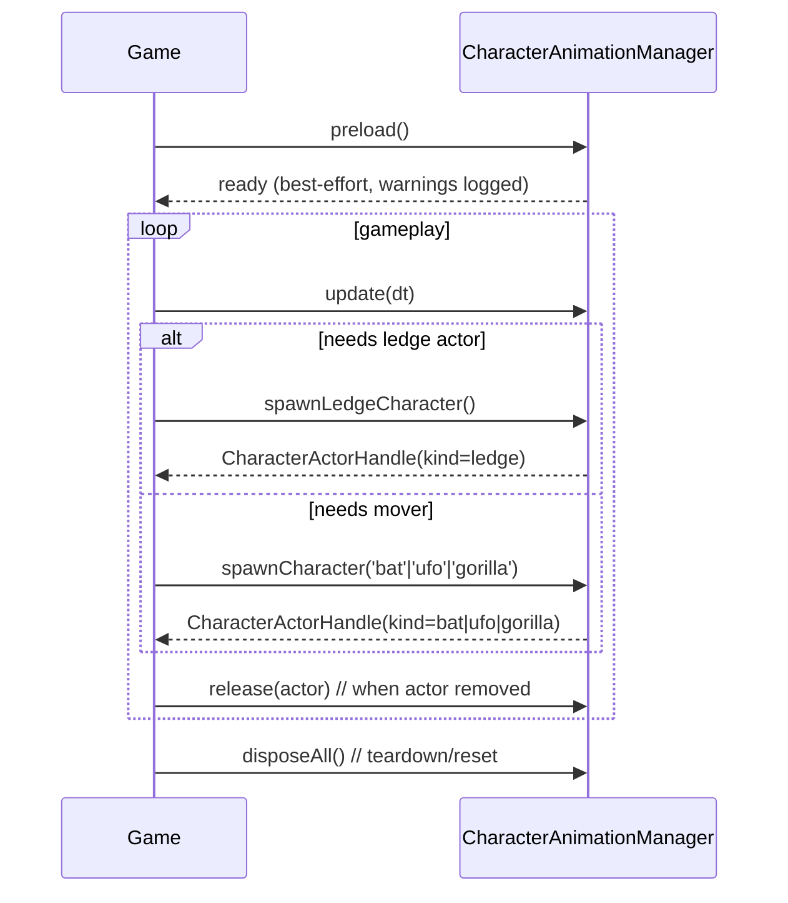

# Research: Main-Game Facade Method Options

## Requirements Recap from Clarification

- Main game should not select individual ledge character identity.
- Main game should request explicit moving non-ledge type (`bat | ufo | gorilla`).
- Manager should own preload/loading and internal animation details.
- Explicit `update(dt)` required for determinism.
- Lifecycle cleanup methods required.
- Best-effort loading with fallback placeholder behavior.

## Candidate Public API (recommended)

```ts
interface CharacterAnimationManager {
  preload(): Promise<void>;

  // Ledge path: manager internally picks next humanoid + next animation.
  spawnLedgeCharacter(): CharacterActorHandle;

  // Moving non-ledge path: explicit game request for pathing control.
  spawnCharacter(type: "bat" | "ufo" | "gorilla"): CharacterActorHandle;

  update(deltaSeconds: number): void;

  release(actor: CharacterActorHandle): void;
  disposeAll(): void;
}
```

### Optional debug-only methods (deferable)

```ts
interface CharacterAnimationDebugApi {
  listCharacterProfiles(): CharacterProfileSummary[];
  listAnimationProfiles(characterId: string): AnimationProfileSummary[];
  setTransformOverride(scope: TransformScope, transform: Partial<Transform3>): void;
  resetTransformOverride(scope: TransformScope): void;
}
```

These can be hidden behind debug mode and excluded from normal game flow.

## Handle shape suggestion

```ts
type CharacterActorHandle = {
  id: string;
  kind: "ledge" | "bat" | "ufo" | "gorilla";
  object: unknown; // concrete runtime object (Object3D or overlay proxy) hidden behind adapter
  dispose?: () => void;
};
```

## Integration Sequence (recommended)



## Why this contract fits current repo constraints

- Keeps deterministic stepping and explicit update ownership.
- Avoids exposing clip/model internals to `Game`.
- Supports current split implementation (humanoid 3D + non-humanoid overlay) behind one facade.
- Keeps ledge selection internal while preserving explicit mover control for game pathing.

## Source References
- `src/game/Game.ts`
- `src/game/logic/remy.ts`
- `src/game/logic/distractions.ts`
- `src/game/logic/runtime.ts`
