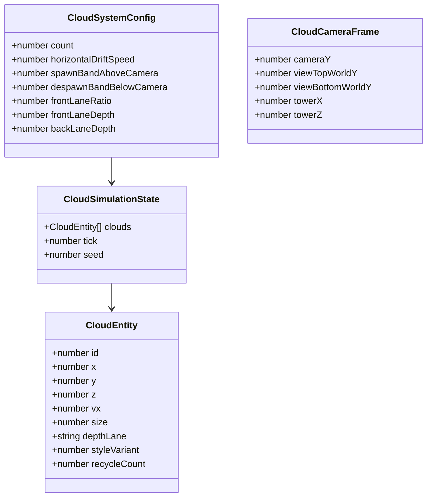
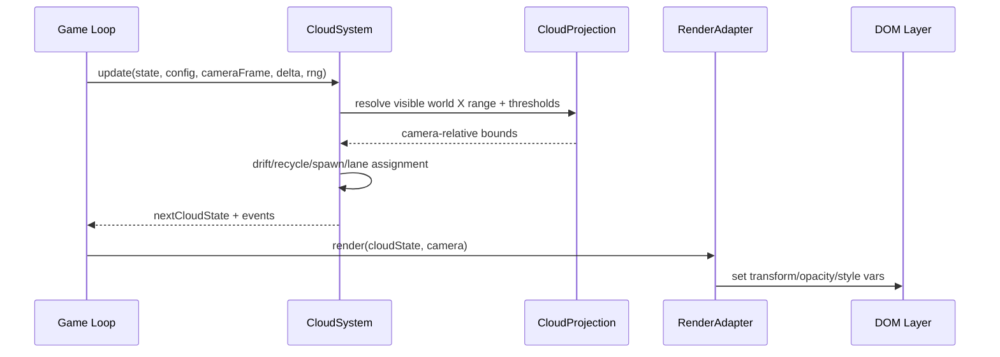

# Detailed Design: Cloud System Rewrite (`cloud fix`)

## Overview

This design replaces the current cloud implementation with a deterministic, world-coordinate cloud subsystem that is easier to reason about and unit test. The rewrite focuses on fixing cloud movement/lifecycle correctness while also upgrading cloud visuals to a smooth, rounded-lobe Mario-style look.

The key behavioral objective is: clouds must feel anchored in world space, while their on-screen motion is a natural consequence of camera movement and world projection. Clouds should not randomly disappear, should recycle predictably, and should preserve depth layering with intentional front/behind stack placement.

---

## Detailed Requirements

Consolidated from `idea-honing.md`:

1. **Movement correctness**
   - Clouds must visually move downward on screen as the stack/camera moves upward.
   - Clouds must not appear stuck at a fixed screen Y.

2. **Lifecycle correctness**
   - Clouds must not randomly disappear.
   - Clouds should exit naturally and recycle only when crossing camera-relative bottom thresholds.
   - Recycling is the default lifecycle strategy (not destroy/recreate).

3. **Coordinate model**
   - Cloud state is world-coordinate based.
   - Lifecycle thresholds are camera-relative (spawn above camera top band, despawn below camera bottom band).

4. **Vertical behavior policy**
   - No artificial per-tick vertical cap.
   - No continuous ambient downward drift policy; vertical on-screen movement should primarily result from camera ascent/world projection.

5. **Horizontal behavior policy**
   - Clouds have slow continuous horizontal drift.
   - Spawn X samples across full visible world width (allowing partial clipping at screen edges).

6. **Depth layering policy (Z importance)**
   - Maintain an intentional mix of clouds in front of and behind the stack.
   - Z/depth assignment must be explicit and deterministic.

7. **Visual style**
   - Replace current cloud look with procedural rounded-lobe chunky Mario-style clouds.
   - Must remain smooth/non-pixelized.

8. **Debug/tuning surface**
   - Add runtime cloud controls: horizontal drift speed, spawn-above-camera band, despawn-below-camera threshold, cloud count/density.

9. **Testing and determinism**
   - Cloud behavior logic should be strongly unit-testable.
   - Deterministic mode must reproduce cloud positions/motion for same seed + steps.
   - Acceptance checks must include camera ascent Y behavior, threshold lifecycle, spawn coverage with clipping allowance, and deterministic repeatability.

10. **Implementation freedom**
   - Full replacement of existing cloud implementation is explicitly acceptable.

11. **Performance expectation**
   - No noticeable regression; keep future mobile and potential low-performance mode in mind.

---

## Architecture Overview

The new design introduces a pure simulation module for cloud state and keeps rendering as a thin adapter.

```mermaid
flowchart TD
  A[Game loop / runSimulationStep] --> B[CloudSystem.update]
  B --> C[CloudSimulationState (pure data)]
  B --> D[CameraSnapshot + StackSnapshot + RNG]
  C --> E[CloudRenderAdapter]
  E --> F[DOM cloud nodes transform/opacity/class vars]
  G[DebugConfig cloud controls] --> B
  H[Test API + deterministic seed/step] --> B
```

### Design intent
- Keep cloud rules in pure, testable logic.
- Keep DOM/CSS rendering dumb: consume computed world/projected output.
- Make camera-relative lifecycle thresholds first-class data.

---

## Components and Interfaces

### 1) `logic/cloudSystem.ts` (new, pure)

Primary responsibilities:
- initialize deterministic cloud entities,
- update horizontal drift,
- evaluate recycle conditions from camera-relative thresholds,
- spawn/recycle clouds with explicit depth lane assignment (front/back),
- output next immutable/safely-mutable state.

Core types (new):
- `CloudEntity`:
  - `id`, `x`, `y`, `z`, `vx`, `size`, `depthLane` (`front` | `back`), `styleVariant`, `recycleCount`
- `CloudSystemConfig`:
  - `count`, `horizontalDriftSpeed`, `spawnBandAboveCamera`, `despawnBandBelowCamera`, `frontLaneRatio`, optional lane depth distances
- `CloudCameraFrame`:
  - camera pose and helper world bounds for current view
- `CloudUpdateResult`:
  - next entity list + lifecycle events (`recycledIds`) + optional diagnostics

### 2) `logic/cloudProjection.ts` (new, pure helper)

Responsibilities:
- derive visible-world X span at target cloud Y for current camera,
- convert world points to projected screen-space metadata for render adapter.

### 3) `Game.ts` integration changes

Responsibilities after rewrite:
- hold `CloudSimulationState` instance,
- call `cloudSystem.update(...)` each relevant simulation tick,
- pass results to render adapter,
- remove old mixed-anchor logic (`createCloudAnchor`, periodic level interval respawn policy, ad-hoc bob behavior).

### 4) Cloud render adapter (in `Game.ts` or extracted)

Responsibilities:
- ensure DOM node pool size matches cloud count,
- apply transform/opacity and style classes/vars,
- apply front/back visual treatment (e.g., slight opacity/tone differences),
- no lifecycle decisions.

### 5) Debug config extension

Extend `DebugConfig`/clamp/default + debug panel ranges with cloud keys:
- `cloudCount`
- `cloudHorizontalDriftSpeed`
- `cloudSpawnBandAboveCamera`
- `cloudDespawnBandBelowCamera`
- (optional) `cloudFrontLaneRatio` and/or lane depth distances

### 6) Test API extension (test mode only)

Extend `getState()` with cloud diagnostics:
- cloud world positions,
- lane (`front/back`),
- recycle counters.

This enables deterministic assertions without relying only on DOM transforms.

---

## Data Models



### Lifecycle rules
- **Despawn condition:** cloud world Y projects below `viewBottomWorldY - despawnBandBelowCamera`.
- **Recycle target Y:** sampled in `[viewTopWorldY + minBand, viewTopWorldY + maxBand]`.
- **X spawn sampling:** from visible world width interval with configurable overscan to permit partial clipping.
- **Depth lane assignment:** deterministic front/back mix policy maintained continuously.

---

## Error Handling

1. **Invalid numeric state**
   - If non-finite cloud coordinates/velocity detected, sanitize and recycle cloud immediately.

2. **Debug config out of range**
   - Clamp in `clampDebugConfig` and mirror ranges in UI sliders.

3. **Cloud count mismatch with DOM nodes**
   - Render adapter reconciles node pool size every update/config change.

4. **Projection edge cases (camera rays nearly parallel)**
   - `cloudProjection` returns safe fallback world bounds for current frame.

5. **Deterministic mode safety**
   - Update logic uses only seed-driven RNG + explicit inputs (delta/config/camera frame).

---

## Testing Strategy

### Unit tests (primary)

New tests for pure cloud logic:
1. camera ascent causes projected screen Y change in expected direction.
2. recycle occurs only after crossing configured bottom threshold.
3. spawn X sampling covers visible width with edge clipping allowance.
4. deterministic replay: same seed + same step sequence => identical cloud trajectories.
5. front/back lane mix maintained over initialization and recycling.
6. horizontal drift applied consistently, independent of stack ascent policy.
7. invalid numeric state recovery path recycles safely.

Existing `tests/unit/clouds.test.ts` should be replaced/expanded to target new module semantics.

### Playwright E2E

Add/extend cloud-focused E2E cases:
- scripted climb with paused stepping confirms clouds move down screen as camera ascends,
- no abrupt disappear before threshold crossing,
- debug controls immediately affect runtime cloud behavior,
- deterministic test mode yields stable cloud snapshots (state + transform tolerances),
- front/back layer presence asserted via exposed cloud state diagnostics.

### Coverage
- Keep non-rendering cloud logic in pure module(s) to preserve >=90% non-rendering unit coverage target.

---

## Appendices

### A) Technology Choices

1. **Full rewrite over patching**
   - **Pros:** simpler mental model, cleaner tests, fewer legacy edge paths.
   - **Cons:** requires migration of current integration/tests.

2. **Pure simulation + thin render adapter**
   - **Pros:** deterministic and unit-testable; avoids DOM/math coupling.
   - **Cons:** introduces additional module boundaries.

3. **DOM/CSS rounded-lobe visuals (not sprites)**
   - **Pros:** fast to iterate, no asset pipeline overhead, aligns with requirement.
   - **Cons:** silhouette control is less exact than hand-authored SVG/sprites.

### B) Research Findings Summary

From research docs:
- current system combines camera/NDC-seeded anchors + projected respawn rules + periodic level-based respawn,
- time-based Y bob and behind-camera respawn contribute to undesired behavior,
- cloud count and controls are currently limited,
- deterministic test surface exists and can be extended effectively.

References:
- `research/current-cloud-system.md`
- `research/camera-and-coordinate-flow.md`
- `research/testing-and-debug-hooks.md`
- `research/rendering-style-options.md`

### C) Alternative Approaches Considered

1. **Patch current implementation in place**
   - Rejected in favor of rewrite due to accumulated mixed responsibilities and lower confidence in regression resistance.

2. **Canvas/WebGL cloud rendering instead of DOM layer**
   - Deferred; current DOM overlay path is adequate and lower-risk for this milestone.

3. **Sprite-based cloud art**
   - Rejected per requirement (procedural in-code, smooth non-pixelized).

---

## Component/Data Flow (Detailed)


