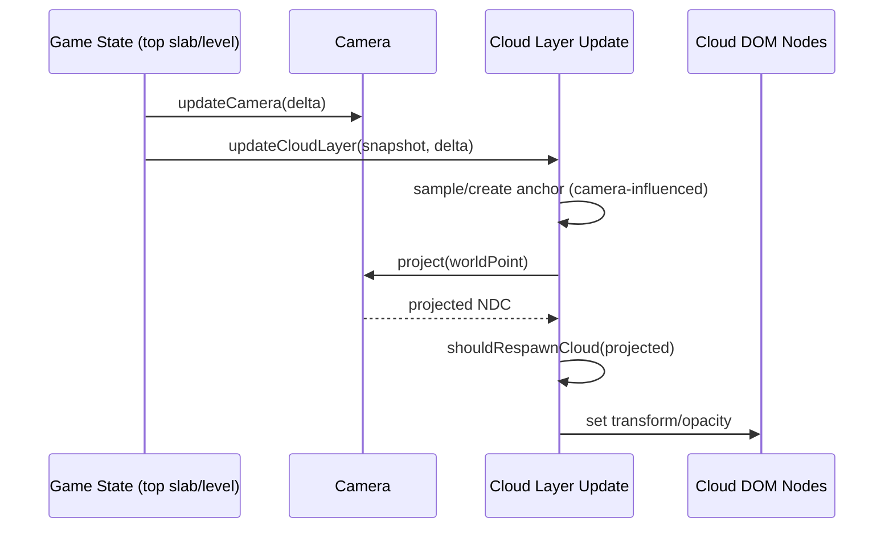

# Camera and Coordinate Flow Research

## Goal
Understand how camera updates and cloud coordinates interact, and where mismatches can cause perceived cloud motion bugs.

## Camera Flow Summary

- Camera target Y is derived from tower state (`focusY + cameraHeight`) in `updateCamera(...)`.
- Camera lerp and additive effects (tremor/placement shake/wobble) modify final camera position each step.
- In test mode, `runSimulationStep(...)` updates camera and distraction actors deterministically by fixed step.

## Cloud Coordinate Flow (Current)

1. Anchor generated in world coordinates but seeded from camera-relative NDC targeting.
2. Per-frame world point applies sway + bob offsets.
3. World point projected through camera to screen-space transform.
4. DOM cloud node translated to projected pixel coordinates.
5. Respawn decision is based on projected point rules, not explicit camera-relative world thresholds.

## Why This Can Produce Unwanted Behavior

- NDC-targeted anchoring means cloud placement is influenced by current camera framing at spawn time.
- Time-driven Y bob means vertical motion exists independently of ascent.
- Behind-camera respawn (`projected.z > 1.1`) can reset clouds that are still conceptually valid in world space.
- LOD update stride can make movement appear to freeze/jump on some quality tiers.

## Requirement Fit Analysis

Requested behavior requires:
- world-stable anchors,
- camera-relative spawn/despawn thresholds,
- vertical screen movement primarily due to camera ascent,
- explicit front/back depth mix.

Current implementation only partially satisfies these.

## Data Flow Diagram

## Sources
- `src/game/Game.ts` (`runSimulationStep`, `updateCamera`, `updateCloudLayer`, `createCloudAnchor`)
- `src/game/logic/clouds.ts`
- `src/game/logic/performance.ts` (`shouldUpdateForLod`)
