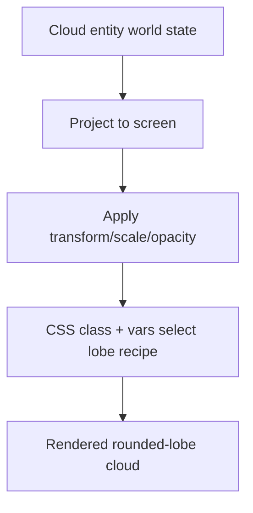

# Cloud Rendering Style Options Research

## Current Rendering

- Clouds are HTML elements (``) in overlay layer.
- Style is a single blurred radial-gradient oval.
- Transform/scale/opacity are driven per frame from projected world points.

This is lightweight but does not match requested “chunky Mario-style rounded-lobe” look.

## Viable In-Code Non-Pixelized Options

### Option A — Multi-lobe gradient composition (recommended)
- Keep DOM/cloud overlay architecture.
- Render each cloud with 3–6 rounded lobes using layered radial gradients and pseudo-elements.
- Keep smooth anti-aliased edges (non-pixelized).
- Maintain current transform pipeline (position/scale/opacity) unchanged.

**Pros**
- Minimal architecture churn.
- Preserves current performance profile.
- Easy theming/tuning from CSS vars.

**Cons**
- Shape variety must be generated by CSS classes/variables.

### Option B — SVG cloud templates
- Use inline SVG per cloud with lobe paths.
- Allows cleaner silhouette control and optional subtle outline.

**Pros**
- Better artistic control.

**Cons**
- Slightly higher complexity in generation/DOM handling.

Given requirements and current stack, Option A is the simplest fit.

## Style Architecture Sketch

## Additional Visual Requirement Integration

User requirement update: maintain **mixed depth** (some clouds in front of stack, some behind). This should map to visual treatment too:
- behind-clouds: slightly lower opacity/scale tint,
- front-clouds: fuller opacity for occlusion effect,
- both still obey world-projected placement.

## Sources
- `src/game/Game.ts` (`buildDistractionOverlay`, `updateCloudLayer`)
- `src/styles.css` (`.distraction-cloud`, `.distraction-clouds`)
- `.agents/planning/cloud fix/idea-honing.md`
