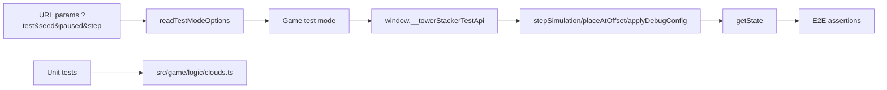

# Testing and Debug Hooks Research

## Existing Testability Surface

### Deterministic test mode
- Query flags parsed in `readTestModeOptions(...)`:
  - `?test` / `?testMode`
  - optional `paused`
  - optional `seed`
  - fixed `step`
- In test mode, `window.__towerStackerTestApi` is exposed.

### Test API capabilities (relevant to clouds)
- `applyDebugConfig(config)`
- `stepSimulation(steps?)`
- `setPaused(paused)`
- `placeAtOffset(offset)`
- `getState()`

### Cloud-specific exposed state today
- `getState().distractions.visuals.cloudOpacity`
- No per-cloud positions/depth lifecycle metadata currently exposed.

## Existing Automated Coverage (Cloud-adjacent)

### Unit
- `tests/unit/clouds.test.ts`
  - respawn off-bottom
  - respawn behind-camera
  - no respawn for left/right only
  - NDC spawn mapping

### E2E
- `tests/e2e/clouds.spec.ts`
  - verifies cloud layer activation and movement screenshots
  - validates clouds remain visible before/after scripted steps
- `tests/e2e/gameplay.spec.ts`
  - cloud actor gating/activation and motion checks

## Gap Against New Requirements

Required acceptance checks include camera-ascent Y behavior, threshold-based lifecycle, spawn-width policy (with clipping), deterministic repeatability, and explicit front/back depth mix.

Current tests do **not** fully validate:
- camera-relative world threshold semantics,
- recycle-only lifecycle policy,
- front-vs-behind stack mixture invariants,
- per-cloud deterministic trajectory comparison.

## Recommended Additions for Design Phase

1. **Pure cloud simulation module** (non-rendering) for unit tests:
   - spawn sampling,
   - world updates,
   - recycle rules,
   - front/back assignment,
   - deterministic RNG usage.

2. **Debug controls for cloud tuning**:
   - horizontal drift speed,
   - spawn-above-camera band,
   - despawn-below-camera threshold,
   - cloud count/density,
   - optional front/back ratio.

3. **Expanded test API readout** (safe debug/test only):
   - per-cloud world x/y/z,
   - front/behind classification,
   - recycled count/events.

## Test Surface Diagram

## Sources
- `src/game/logic/runtime.ts`
- `src/game/Game.ts` (`createTestApi`, `getPublicState`)
- `tests/unit/clouds.test.ts`
- `tests/e2e/clouds.spec.ts`
- `tests/e2e/gameplay.spec.ts`
- `docs/features.md`
