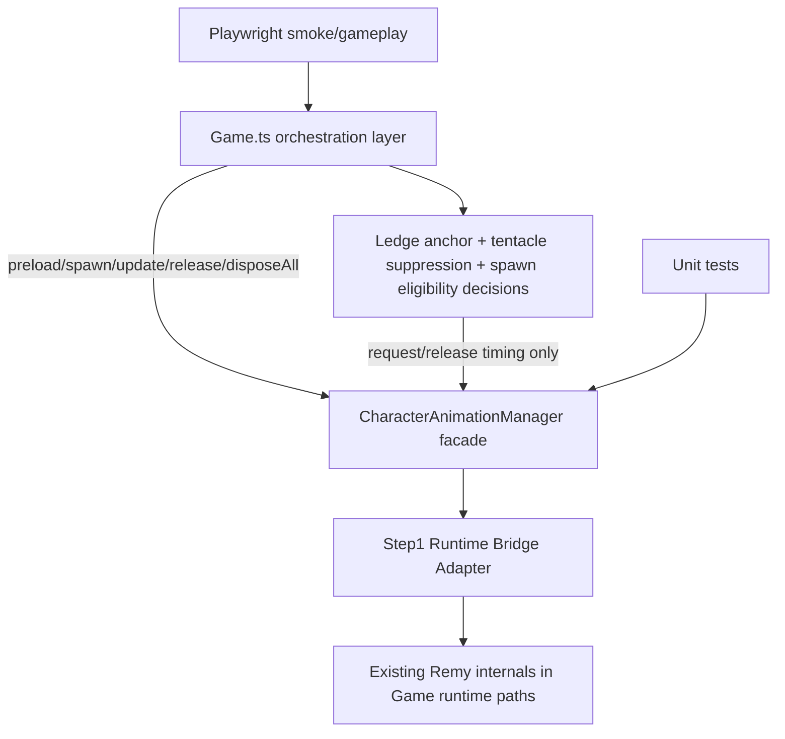
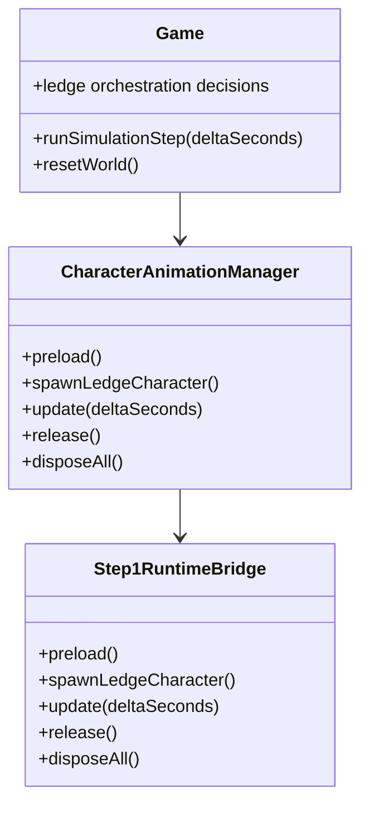

# Design — animation-system-refactor-step-1

## 1. Overview

Step 1 establishes a strict facade boundary for ledge-character lifecycle calls while intentionally preserving current behavior and internals.

Today, `Game.ts` directly executes ledge-character preload, spawn/update, detach, and reset teardown logic through Remy-specific methods. This step introduces a `CharacterAnimationManager` that becomes the only lifecycle entrypoint used by `Game` for ledge characters. The manager may remain a thin bridge to existing internals in this step.

Primary outcome for Step 1: **call routing and ownership boundary change**, not behavior change.

---

## 2. Detailed Requirements

1. `Game` must route ledge-character lifecycle entrypoints through `CharacterAnimationManager` (`preload`, `spawnLedgeCharacter`, `update`, `release`, `disposeAll`).
2. Gameplay-visible behavior must remain equivalent to current baseline.
3. Bridge-style internals are acceptable in this step (no forced extraction of loader/selection/retarget internals yet).
4. Ledge-world orchestration (anchor discovery, suppression checks, request/release decision points) remains in `Game`.
5. Deferred scope remains deferred (Steps 2–7): deterministic selection extraction, profile debug migration, naming cleanup, non-ledge explicit branch, preload fallback hardening, lifecycle store hardening.
6. Step 1 must include contract-focused unit tests and update-forwarding regression tests.
7. Playwright smoke/gameplay paths must pass unchanged.

---

## 3. Architecture Overview

### Architectural intent
- `Game` remains responsible for *when* ledge actors should exist.
- `CharacterAnimationManager` becomes responsible for *how lifecycle entrypoints are invoked*.
- Existing Remy runtime logic stays intact behind the bridge for this step, minimizing regression risk.

---

## 4. Components and Interfaces

### 4.1 `CharacterAnimationManager` (new facade)

| Method | Responsibility in Step 1 | Notes |
|---|---|---|
| `preload()` | Trigger current ledge-character preload path | Bridge to existing load/init behavior |
| `spawnLedgeCharacter()` | Trigger ledge-character spawn/refresh path | Called when `Game` decides spawn is needed |
| `update(deltaSeconds)` | Forward per-frame animation tick | Replaces direct `updateRemyAnimation` call |
| `release()` | Trigger detach/unmount for active ledge character(s) | Used for suppression/anchor-loss detach points |
| `disposeAll()` | Trigger reset teardown cleanup for all managed ledge actors | Used during `resetWorld` and equivalent hard reset flows |

### 4.2 Step1 Runtime Bridge Adapter

A private adapter (owned by the manager) maps facade methods to current runtime internals. This preserves baseline behavior while enforcing the new call boundary.

### 4.3 `Game.ts` integration points

| Existing direct behavior | Step 1 routing change |
|---|---|
| Direct per-frame Remy mixer update call | Replace with `characterAnimationManager.update(dt)` |
| Direct detach/reset cleanup calls | Replace with `characterAnimationManager.release()` / `disposeAll()` |
| Direct preload/spawn refresh entrypoint calls | Replace with `characterAnimationManager.preload()` / `spawnLedgeCharacter()` |

---

## 5. Data Models

Step 1 keeps data model changes intentionally minimal.

### State ownership in Step 1
- Manager state: minimal lifecycle forwarding state only (if needed for safety guards).
- Existing Remy runtime state remains in current locations behind the bridge.
- No new actor-store model is required in this step (explicitly deferred to Step 7).

---

## 6. Error Handling

1. **Invalid or non-positive `deltaSeconds` in `update`**
   - Follow current no-op behavior to avoid drift.

2. **Repeated `release`/`disposeAll` calls**
   - Must be safe/no-op compatible with current detach behavior.
   - Full idempotence hardening is deferred, but Step 1 cannot introduce throw-on-repeat behavior.

3. **Preload/spawn path errors**
   - Preserve existing warning/log behavior.
   - Do not change fallback strategy in Step 1 beyond current behavior.

4. **Bridge mismatch risk**
   - Mitigate with unit tests verifying each facade method forwards to exactly one underlying bridge call.

---

## 7. Testing Strategy

### Unit tests (required in Step 1)
1. **Facade contract test**
   - Manager exposes required methods and forwards calls to bridge dependencies.
2. **Forwarding semantics test**
   - Each facade method invokes exactly one corresponding bridge method.
3. **Update forwarding regression**
   - Simulation frame path routes one and only one `update(dt)` call per frame tick path.

### Integration/Regression checks
- Run existing unit suite to ensure no regressions in current Remy/distraction logic.
- Run Playwright smoke/gameplay core flow (start/play/place/miss/restart) to confirm behavior stability.

### Coverage alignment
- Place new manager/bridge policy logic in unit-test-covered paths so existing >=90% non-rendering coverage expectations remain enforceable.

---

## 8. Appendices

### A. Technology choices (pros/cons)

**Chosen: Thin facade + bridge adapter in Step 1**
- Pros: Lowest behavior drift risk, fast boundary establishment, enables incremental follow-up steps.
- Cons: Temporary duplication/indirection until deeper extraction lands.

**Not chosen now: Immediate full extraction from `Game.ts`**
- Pros: Cleaner architecture immediately.
- Cons: High regression risk and larger blast radius for Step 1.

### B. Alternatives considered

1. **Rename-only pass without manager**
   - Rejected: does not create enforceable ownership boundary.
2. **Implement Step 1 + Step 2 together**
   - Rejected: couples boundary and selection refactor, reducing debuggability if regressions appear.

### C. Key constraints and limitations

- Must preserve current gameplay behavior.
- Must not consume scope from Steps 2–7.
- Must keep deterministic/testing posture intact.
- Step 1 is foundational; deeper modularization intentionally follows in later steps.