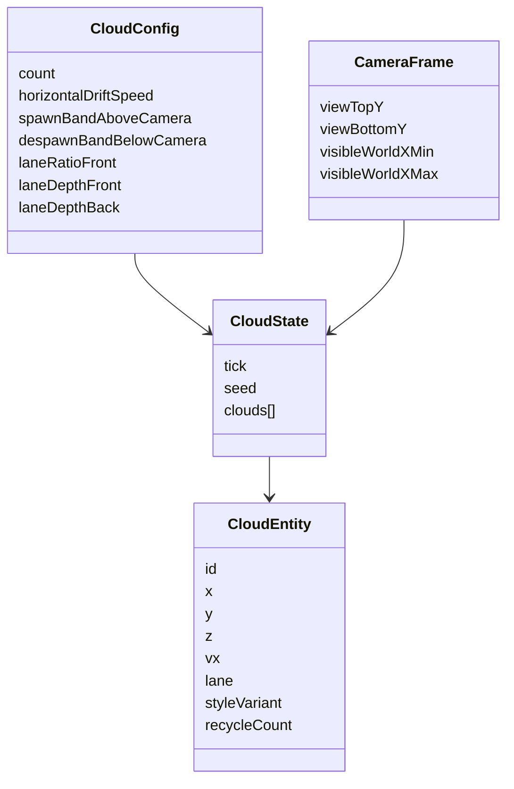

# Cloud Fix Plan — Detailed Design

## 1. Overview
The current cloud behavior needs a deterministic rewrite so clouds behave like world-space objects, recycle predictably, and remain testable under seeded stepping. This design introduces a pure cloud simulation domain, integrates it into the game loop, upgrades cloud visuals to rounded-lobe procedural DOM/CSS rendering, and expands debug/test observability.

The solution is intentionally scoped to cloud-specific fixes and excludes broad camera/background/weather architecture changes.

## 2. Detailed Requirements
1. Cloud simulation must be deterministic for identical seed/config/step inputs.
2. Cloud lifecycle must be camera-relative: despawn below threshold, recycle above spawn band.
3. Clouds must not disappear before threshold crossing under valid configuration.
4. Depth lane policy must maintain an explicit front/back mix and deterministic assignment over recycle.
5. Horizontal drift must be supported and tunable.
6. Vertical cloud movement should come from world/camera projection behavior, not ambient downward drift policy.
7. Runtime debug controls must include count/density, drift speed, spawn-above band, despawn-below threshold (lane controls optional).
8. Debug values must be clamped/sanitized; invalid combinations must be normalized into safe effective values.
9. Rounded-lobe smooth cloud visuals must replace legacy simple cloud style.
10. Test-mode state must expose per-cloud diagnostics sufficient for deterministic assertions.
11. Unit + Playwright coverage must enforce acceptance gates and no regression in core gameplay/performance smoke checks.
12. Documentation must reflect shipped behavior and controls.
13. Out-of-scope items from requirements must remain untouched (weather, broad background/camera refactors, unrelated gameplay tuning, new perf-mode architecture).

## 3. Architecture Overview
```mermaid
flowchart TB
    A[Game Loop / Simulation Step] --> B[Cloud Simulation Module]
    C[Debug Config + Clamp/Sanitize] --> B
    D[Camera/View Snapshot] --> B
    E[Seeded RNG + Deterministic Step Inputs] --> B

    B --> F[Cloud State: world position, lane, recycle metadata]
    F --> G[Render Adapter]
    G --> H[DOM/CSS Rounded-Lobe Clouds]

    F --> I[Test API getState() Cloud Diagnostics]
```

### Architectural intent
- Keep cloud behavior in non-rendering pure logic for high unit-test coverage.
- Keep rendering as an adapter over simulation outputs.
- Make debug clamping/sanitization explicit so extreme control values become valid deterministic modes.

## 4. Components and Interfaces
### 4.1 Cloud Simulation Domain (pure logic)
**Responsibilities**
- Initialize cloud entities deterministically.
- Update positions each step using drift policy.
- Evaluate despawn threshold and perform recycle with deterministic reseeding.
- Preserve lane policy and bounded entity count.

**Interface (conceptual)**
- `initializeCloudState(config, seed, cameraFrame) -> CloudState`
- `stepCloudState(prevState, config, cameraFrame, delta, rng) -> CloudState + diagnostics/events`

### 4.2 Lifecycle & Bounds Policy
**Responsibilities**
- Compute effective spawn/despawn bands relative to camera view.
- Sanitize invalid/inverted threshold values before use.
- Guarantee no recycle prior to effective despawn crossing.

### 4.3 Lane Policy
**Responsibilities**
- Deterministic assignment of `front|back` lane.
- Maintain mixed-lane composition when count allows.
- Provide lane depth offsets used by render projection.

### 4.4 Render Adapter (DOM/CSS)
**Responsibilities**
- Reconcile DOM node pool with active cloud count.
- Apply transforms/style variables/classes from simulation state.
- Render rounded-lobe visual variants; optionally apply subtle lane-specific visual differentiation.

### 4.5 Debug Surface Integration
**Responsibilities**
- Add cloud controls to `?debug` UI metadata.
- Clamp and sanitize runtime values.
- Apply live updates to simulation behavior without restart.

### 4.6 Test API Diagnostics
**Responsibilities**
- Extend test-mode `getState()` with per-cloud diagnostics:
  - world x/y/z
  - lane
  - recycle count/event metadata
- Keep existing API fields backward compatible.

## 5. Data Models


## 6. Error Handling
1. **Non-finite numeric cloud state**
   - Sanitize and recycle affected entity to a valid spawn range.
2. **Out-of-range debug control values**
   - Clamp to allowed ranges; for coupled thresholds, sanitize to valid ordering/min separation.
3. **Count extremes**
   - Respect clamped min/max without overspawn or ID duplication.
4. **Zero drift mode**
   - Treat as valid static-X configuration, not as error.
5. **Potential recycle thrash from tight controls**
   - Allow fast recycle only when thresholds are valid and crossing-driven; prevent pathological every-frame thrash from invalid inputs via sanitization.

## 7. Testing Strategy
### Unit tests (non-rendering priority)
- Deterministic initialization replay.
- Deterministic trajectory replay for same seed + steps (<= 1e-4 float tolerance).
- Threshold-gated recycle behavior (no pre-threshold recycle).
- Recycle spawn band correctness.
- Visible-width X spawn sampling with clipping allowance.
- Lane-mix invariants across init + recycle.
- Drift behavior, including explicit zero-drift semantics.
- Clamp/sanitization rules for debug controls and threshold ordering.

### Integration/adapter tests
- Mapping from cloud state to render adapter attributes/classes remains consistent.
- Debug updates change simulation outputs live.

### Playwright E2E
- Scripted ascent verifies cloud screen movement and lifecycle behavior.
- Deterministic cloud diagnostics snapshot comparisons.
- Mixed front/back lane presence in both diagnostics and rendered scene.
- Debug slider interaction validates live effects and clamp behavior.
- Full core gameplay + performance smoke non-regression pass.

## 8. Appendices
### A. Technology Choices
1. **Pure logic module + adapter split**
   - Pros: deterministic, testable, maintainable.
   - Cons: additional integration boundaries.
2. **DOM/CSS rounded-lobe rendering**
   - Pros: no new asset pipeline, quick iteration.
   - Cons: less artist-authored control than sprite/SVG sets.
3. **Recycle-in-place lifecycle**
   - Pros: stable IDs, deterministic diagnostics.
   - Cons: requires careful threshold math to avoid visible popping.

### B. Alternatives Considered
1. **Patch legacy cloud logic in place**
   - Rejected: mixed responsibilities and higher regression risk.
2. **Introduce new parallax/weather framework concurrently**
   - Rejected: explicitly out-of-scope for milestone.
3. **Canvas/WebGL cloud renderer rewrite**
   - Deferred: unnecessary for current acceptance criteria.

### C. Constraints and Limitations
1. Must preserve existing deterministic test harness conventions.
2. Must maintain core gameplay and performance smoke behavior.
3. Must not expand milestone into unrelated rendering/camera systems.
