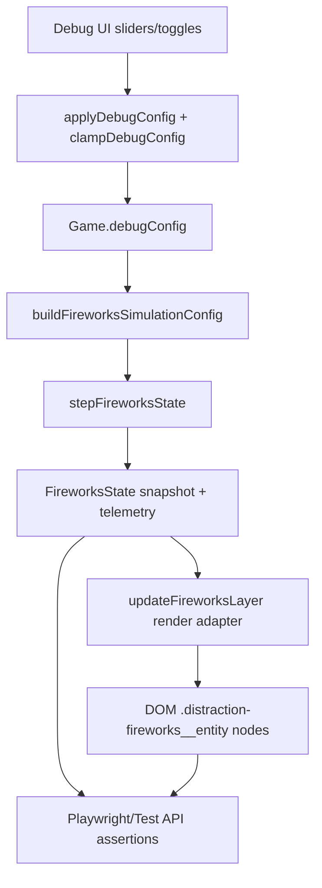
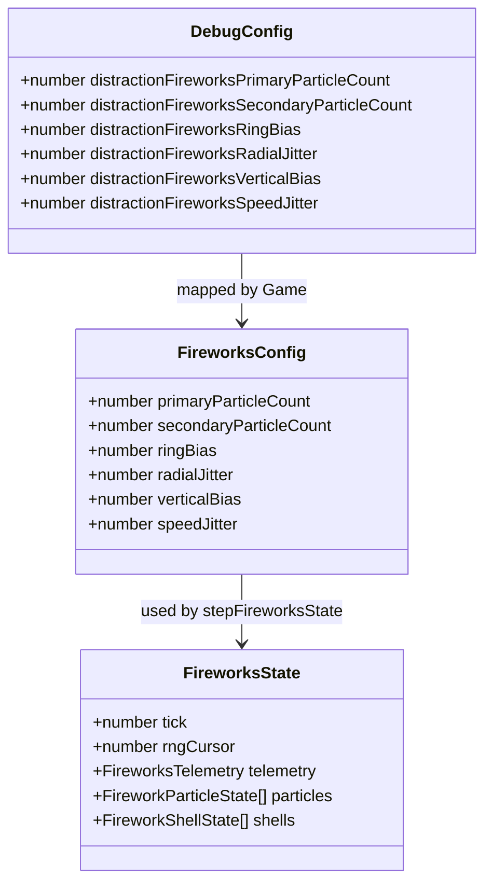

# Design — Fireworks Chrysanthemum Starburst

## 1) Overview
The current fireworks system already provides deterministic shell/particle lifecycle simulation, debug-config control, and DOM render adaptation. This design extends that foundation to produce a canonical chrysanthemum-style starburst by adding morphology controls, deterministic isotropic emission, and a stable visual regression gate.

The implementation intentionally reuses existing architecture:
- Debug controls are source-of-truth through `DebugConfig` + clamping.
- Simulation remains pure/deterministic in `logic/fireworks.ts`.
- `Game` maps simulation state to DOM actor nodes for e2e assertions.

## 2) Detailed Requirements

R1. Add chrysanthemum control fields to debug + simulation config types and defaults.

R2. Clamp/normalize all new numeric controls (including min/max pair normalization and integer rounding for count-like values).

R3. Replace burst-direction generation with deterministic isotropic spherical sampling.

R4. Replace fixed primary/secondary counts with config-driven counts.

R5. Add ring/jitter/vertical-bias shaping controls with bounded ranges.

R6. Preserve cap guardrails and degradation priority (secondary first).

R7. Expose all new controls in runtime debug panel (`DEBUG_RANGES`) and simulation mapping (`buildFireworksSimulationConfig`).

R8. Preserve paused deterministic semantics for debug-apply + manual stepping in test mode.

R9. Extend unit tests to validate clamp behavior, deterministic morphology, and cap/degradation invariants.

R10. Add deterministic Playwright screenshot test using canonical capture contract:
- seed: 42
- mode: `?debug&test&paused=1`
- capture anchor: first `primaryBursts` transition + 2 ticks
- baseline: `tests/e2e/fireworks.spec.ts-snapshots/fireworks-chrysanthemum-canonical-chromium-darwin.png`
- screenshot options: animations disabled, caret hide, css scale, threshold 0.12, maxDiffPixels 180.

R11. Tune defaults to match reference style while preserving perf/cap safety.

R12. Complete regression and docs updates.

## 3) Architecture Overview

Key boundary: morphology generation stays in simulation core (E), not in render adapter (G), to keep deterministic testing non-rendering and robust.

## 4) Components and Interfaces

1. **`DebugConfig` / `defaultDebugConfig` / `clampDebugConfig`**
   - Responsibility: define runtime-tunable knobs and enforce safe ranges.
   - Interface impact:
     - Add new fireworks morphology fields.
     - Add pair normalization where fields are min/max.
     - Add integer coercion for count controls.

2. **`FireworksConfig` + `sanitizeFireworksConfig`**
   - Responsibility: simulation-facing sanitized parameter set.
   - Interface impact:
     - Extend with morphology controls used by particle emission.
     - Keep deterministic behavior independent of frame rate through explicit `deltaSeconds` + cursor usage.

3. **`stepFireworksState` / `emitBurstParticles` path**
   - Responsibility: deterministic lifecycle stepping and burst emission.
   - Interface impact:
     - Emission algorithm upgraded to isotropic sampling + configurable shaping.
     - Count controls replace fixed constants.
     - Existing telemetry fields remain backward-compatible.

4. **`Game.buildFireworksSimulationConfig` + debug panel**
   - Responsibility: bridge runtime config to simulation and expose tuning controls.
   - Interface impact:
     - Map all new fields from `debugConfig` into simulation config.
     - Add new slider metadata in `DEBUG_RANGES`.

5. **Playwright deterministic visual spec**
   - Responsibility: CI visual acceptance gate for canonical chrysanthemum look.
   - Interface impact:
     - Extend `tests/e2e/fireworks.spec.ts` with one screenshot scenario anchored to deterministic burst timing.

## 5) Data Models

Proposed model extension (conceptual):

Notes:
- Field names above are design-level; exact names should align with repo naming conventions (`distractionFireworks...`).
- No new style enum is introduced; one configurable morphology path remains.

## 6) Error Handling

1. **Invalid debug input values**
   - Mitigation: clamp and normalize in `clampDebugConfig` + `sanitizeFireworksConfig`.

2. **Min/max inversion and non-finite values**
   - Mitigation: normalize pairs to ordered bounds, finite fallback behavior.

3. **Cap overflow risk from increased counts**
   - Mitigation: preserve `maxActiveParticles` hard cap and secondary-first degradation.

4. **Screenshot flakiness in CI**
   - Mitigation: deterministic paused stepping, explicit burst-relative capture timing, and fixed snapshot tolerances.

5. **Paused-mode race conditions**
   - Mitigation: keep config application step-gated and assert behavior through existing paused tests.

## 7) Testing Strategy

- **Unit tests (primary coverage target)**
  - `tests/unit/debugConfig.test.ts`
    - New knob clamp bounds
    - min/max normalization
    - integer rounding for count controls
  - `tests/unit/fireworks.test.ts`
    - deterministic same-seed replay for morphology controls
    - isotropic distribution sanity checks at neutral bias
    - ring/bias/jitter bounded behavior
    - cap/degradation invariants under stress

- **Integration/e2e deterministic behavior**
  - Extend `tests/e2e/fireworks.spec.ts` with canonical screenshot test using fixed contract.
  - Keep existing lifecycle/render metadata/cap tests green.

- **Regression gates**
  - Run full unit and Playwright suites.
  - Maintain non-rendering coverage threshold >= 90%.

## 8) Appendices

### A) Technology choices
1. **Keep DOM overlay render adapter for fireworks**
   - Pros: existing test hooks, metadata assertions, deterministic node lifecycle checks.
   - Cons: visually less rich than shader particles.

2. **Use Playwright screenshot baseline for visual gate**
   - Pros: direct regression signal for morphology drift.
   - Cons: baseline upkeep required across meaningful art changes.

### B) Alternative approaches considered
1. **Multiple named style presets (e.g., chrysanthemum/peony/willow)**
   - Rejected for this scope: adds mode complexity and conflicts with requirement to keep one universal burst style.

2. **GPU particle rendering for fireworks visuals**
   - Deferred: increases complexity and weakens current deterministic DOM-level testability.

### C) Constraints and limitations
- Determinism must be preserved across seeds and fixed-step replay.
- Paused test mode/manual stepping is authoritative for e2e synchronization.
- Visual acceptance is anchored to a single canonical baseline (darwin snapshot path above).
