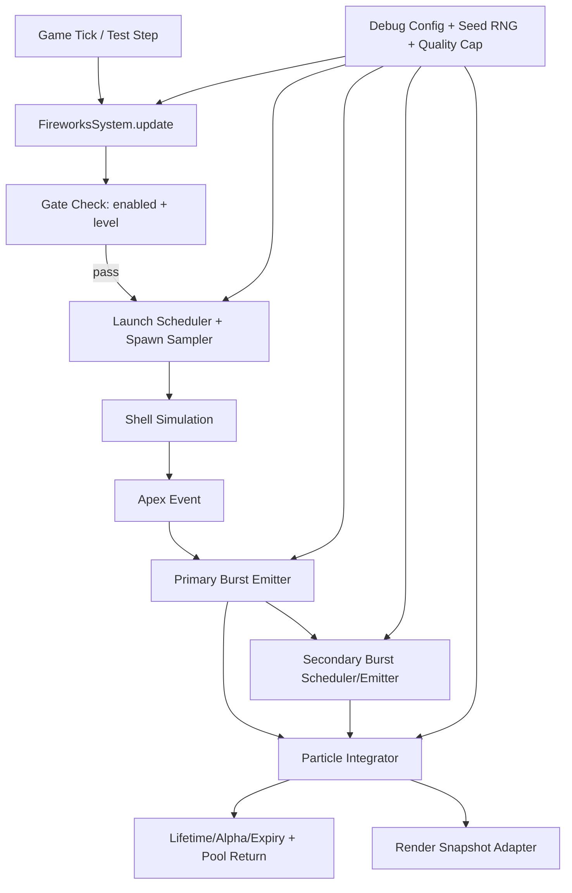
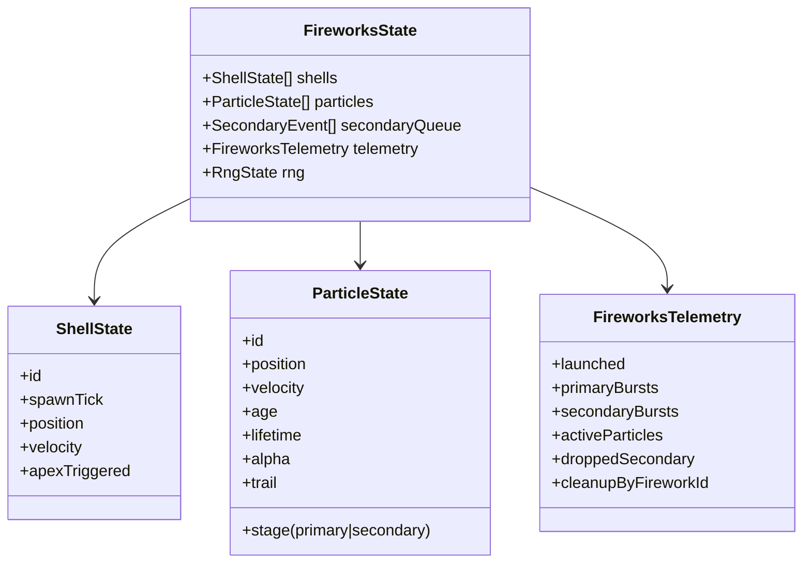

# Design — improve-fireworks-visual

## 1) Overview
The fireworks channel currently renders as a viewport-anchored pulse effect, which cannot satisfy launch arcs, staged bursts, or deterministic lifecycle assertions. This design introduces a dedicated deterministic fireworks simulation with world-space spawn positions behind the tower, staged shell/particle lifecycle, and a render adapter fed by simulation snapshots.

The solution keeps existing distraction gating semantics (channel enabled + start level) while replacing fireworks-only visual/simulation behavior.

## 2) Detailed Requirements
1. Fireworks must use a staged lifecycle: launch, arc/apex, primary burst, delayed secondary sparks, fade/cleanup.
2. Launches must be world-space behind-stack and varied across background region.
3. Launch cadence and gating must satisfy timing bounds (0.8s–2.4s intervals, no >3.0s starvation in 20s, zero launches when gated off).
4. Shell travel-to-apex must be 0.45s–1.10s with at least 6 visible ticks pre-burst.
5. Exactly one primary burst per shell at apex (±1 tick).
6. Secondary emissions start 0.05s–0.35s after primary and trend downward by mid-life.
7. Primary/secondary/full cleanup must meet required windows and remove expired entities from simulation/rendering.
8. Behavior must be deterministic under fixed-step mode with seeded RNG.
9. Runtime debug controls must tune launch/shell/burst/lifetime/perf settings live.
10. Stress behavior must enforce active particle cap and degrade secondary density first.
11. Out-of-scope boundaries from requirements.md remain enforced.

## 3) Architecture Overview

## 4) Components and Interfaces
### 4.1 FireworksSystem (logic module)
- Owns deterministic RNG stream, shell state, particle state, and counters.
- API (conceptual):
  - `update(dtSeconds, context)`
  - `forceLaunch(count?)`
  - `getSnapshot()` for debug + Playwright assertions

### 4.2 Launch Scheduler + Spawn Sampler
- Maintains launch cooldown sampled within configured interval bounds.
- Samples world-space spawn X/Z from behind-stack region.
- Applies channel gating and stress throttling decisions.

### 4.3 Shell Simulator
- Integrates shell motion with vertical velocity + lateral drift + gravity.
- Emits one apex event per shell, then retires shell.

### 4.4 Primary Burst Emitter
- Emits near-spherical multicolor radial particles.
- Assigns primary trail profile and lifetime bounds.

### 4.5 Secondary Scheduler/Emitter
- Schedules delayed follow-up emission per firework.
- Emits smaller/faster-fading particles with stronger gravity effect.

### 4.6 Particle Integrator + Lifecycle Manager
- Updates position/velocity/drag/gravity.
- Updates age, alpha, optional size-over-life.
- Expires entities and returns them to pools.

### 4.7 Performance Guardrail Layer
- Enforces `maxActiveParticles` hard cap.
- Degradation order:
  1) reduce/skip secondary emissions,
  2) reduce secondary counts,
  3) reduce new launch density.

### 4.8 Render Adapter
- Maps active particles to render data in world space.
- Ensures expired entities are not emitted to renderer.

### 4.9 Debug/Test Surface
- Debug controls: launch interval, shell speed/gravity, primary count/lifetime, secondary delay/count/lifetime, max particles, force launch.
- Snapshot telemetry: launch timestamps, apex ticks, burst counts, active counts, cleanup completion, cap/drop counters.

## 5) Data Models

## 6) Error Handling
1. **Invalid debug values**: sanitize/clamp and normalize min/max pairs.
2. **Cap pressure**: skip/reduce secondary emissions first; never exceed hard cap.
3. **Unexpected lifecycle drift**: fail-safe cleanup for over-age entities to prevent ghosts.
4. **Determinism risk**: ban `Math.random` in simulation path; use seeded stream only.
5. **Render mismatch**: if snapshot references expired IDs, drop them and increment diagnostic counter.

## 7) Testing Strategy
1. **Unit tests (logic/non-rendering)**
   - Deterministic seed replay for full lifecycle timestamps/counters.
   - Launch cadence windows and gating zero-launch behavior.
   - Arc-to-apex timing + single primary burst semantics.
   - Secondary delay window and downward trend checks.
   - Lifetime/fade/cleanup window assertions.
   - Cap enforcement + degradation-order assertions.
   - Config sanitize/clamp coverage.

2. **Playwright tests (core gameplay flow)**
   - Deterministic paused stepping verifies `launch -> primary -> secondary -> cleanup`.
   - Toggle/gating checks (disabled or below level = no launches).
   - Debug control mutations produce measurable count/timing shifts.
   - Stress run asserts cap non-regression and no runaway growth.

3. **Coverage requirement**
   - Maintain >=90% unit coverage for touched non-rendering fireworks logic.

## 8) Appendices
### A. Technology choices
- **Chosen**: deterministic CPU simulation + existing rendering integration.
  - Pros: testability, predictable behavior, incremental integration.
  - Cons: requires careful cap/throttle design.

### B. Alternatives considered
1. Extend current DOM pulse with CSS-only tricks (rejected: cannot meet staged lifecycle).
2. Full GPU particle rewrite (deferred: higher complexity than needed for current scope).

### C. Constraints and limitations
- Fireworks-only scope: no gameplay, non-fireworks visuals, or feedback-system redesign.
- Must remain compatible with existing debug/test harness and distraction gating.
- Must preserve smoothness under stress via local guardrails.
